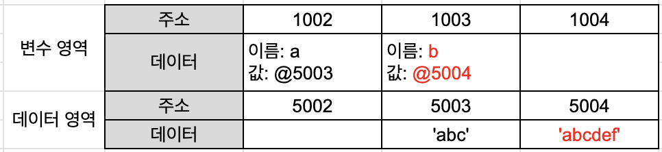
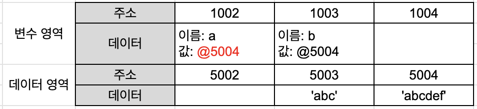
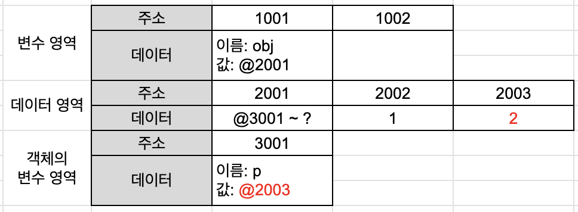

# Ch 01 데이터 타입


## 1️⃣ 데이터 타입의 종류

### 기본형

- Number
- String
- Boolean
- null
- undefined
- Symbol

### 참조형

- Object
    - Array
    - Function
    - Date
    - RegExp
    - Map, WeapMap
    - Set, WeakSet

<aside>
💡

모든 데이터는 첫번째 비트의 식별자(메모리 주소값)를 통해 구분하고 연결할 수 있다.

</aside>

> 식별자와 변수
> 

변수 : 변할 수 있는 데이터, 변경 가능한 데이터가 담길 수 있는 공간

식별자 : 데이터를 식별하는 데 사용하는 이름 (= **변수명**)

## 2️⃣ 변수 선언

### 변수 선언

메모리에서 비어있는 공간을 확보하고 공간의 이름을 변수명으로 지정한다.

## 3️⃣ 기본형 데이터 & 참조형 데이터

> 변수와 상수를 구분하는 `변경 가능성`의 대상은 `변수 영역` 메모리이다.
불변성 여부를 구분하는 대상은 `데이터 영역` 메모리이다.
> 

### 불변값

→ `기본형 데이터`(숫자, 문자열, boolean, null, undefined, Symbol)

메모리 상에 한 번 올라가면 변경되지 ❌

<aside>
✅

새로운 데이터를 할당할 경우 새로운 데이터를 메모리 공간에 새로 올리고 이 주소를 변수에 저장하는데 기본형 데이터는 변경되지 않기 때문에 `불변성`을 띈다, `불변값`이라고 한다.

</aside>

> 기본형 데이터 할당의 전체적인 흐름
> 
- 저장하려는 데이터가 메모리에 존재하는지 찾음.
- 존재 O : 해당 데이터의 주소를 변수 영역에 저장
- 존재 X
    - 별도의 공간 확보 후 데이터 저장
    - 그 주소를 변수 영역에 저장

> 변수 선언 + 데이터 할당
> 

```jsx
var a = ‘abc’;
var b = ‘abcdef’;
```



> 데이터 재할당
> 

```jsx
var a = ‘abc’;
var b = ‘abcdef’;
a = ‘abcdef’;
```



<aside>
🤔

데이터를 변수 영역에 왜 직접 저장하지 않을까?

</aside>

> 변수 영역과 데이터 영역을 분리하면 **중복된 데이터에 대한 처리 효율**이 높아진다.
ex ) 500개 변수에 숫자 5를 할당하는 상황! 별도 공간에 5를 한 번만 저장하고 해당 주소만 입력!
> 

### 가변값

→ 대부분의 `참조형 데이터` (설정에 따라 변경 불가한 경우와 아예 불변값으로 활용하는 방안도 있음)

👉🏻 참조형 데이터와 기본형 데이터의 차이 : `객체의 변수(프로퍼티) 영역`이 별도로 존재

<aside>
✅

데이터 영역에 저장된 값은 모두 불변값이지만, 객체의 변수 영역에는 다른 값을 대입할 수 있어 참조형 데이터는 불변하지 않다(`가변값`이다)라고 한다.

</aside>

> 참조형 데이터의 선언 및 할당
> 
- 빈 공간 확보 후 이름을 변수명으로 지정하여 변수 선언
- 프로퍼티 이름을 저장하는 공간 마련
- 프로퍼티의 주소를 데이터 영역에 저장 후 변수명에 해당하는 공간에 데이터 영역의 주소를 저장
- 프로퍼티를 저장하는 공간에 프로퍼티의 이름으로 공간의 이름을 지정

> 프로퍼티 재할당
> 

```jsx
var obj = {p: 1};
obj.p = 2;
```



### 변수 복사 비교

<aside>
💡

`기본형`은 주솟값을 복사하는 과정이 한 번만 거치고

`참조형`은 한 번 더 거치게 된다

</aside>

## 4️⃣ 불변 객체

<aside>
🤔

어떤 상황에서 불변 객체가 필요할까?

값으로 전달받은 객체에 변경을 가하더라도 원본 객체는 변하지 않아야 하는 상황일 때 필요하다.

</aside>

### 불변 객체 만들기

참조형 데이터의 데이터 자체를 변경하고자 하면 기존 데이터는 변하지 않는다.

→ 새로운 객체에 원본 객체 속 바꾸고자 하는 값과 변경하지 않는 기존 값을 넣는다.

### 얕은 복사와 깊은 복사

- `얕은 복사` : 바로 아래 단계 값만 복사
    - 중첩된 객체에서 참조형 데이터가 저장된 프로퍼티를 복사할 때 주소값만 복사
    - ❗단점 : **사본을 바꾸면 원본도 바뀐다.**
- `깊은 복사` : 내부 모든 값들을 복사
    - 수행 방법
        - 재귀적으로 수행
        - 객체를 문자열로 전환했다가 다시 JSON 객체로 바꾸기
    - ✅ 객체 복사 후 어느 쪽의 프로퍼티를 변경해도 다른 쪽에 영향 주지 X

## 5️⃣ undefined & null

> ‘없음’을 나타내는 값. 두 값의 의미는 미세하게 다르고, 사용 목적 또한 다르다.
둘 다 사용할 수는 있지만, 데이터 타입을 직접 넣어줄 때는 **undefined 보다 null이 더 적합하다.**
> 

### undefined

→ 사용자가 직접 명시할 경우 : 값으로 할당된 undefined 는 실존 데이터

→ JS 엔진이 자동으로 부여할 경우 : 문자 그대로 값이 없음을 의미

> JS 엔진이 undefined 를 반환하는 3가지 경우
> 
- 값을 대입하지 않은 변수에 접근할 때
- 존재하지 않는 객체 내부의 프로퍼티에 접근할 때
- return문이 없거나 호출되지 않은 함수의 실행 결과를 요청할 때

### null

→ ‘비어있음’을 명시적으로 나타내고 싶을 때

<aside>
⚠️

**`null 사용 시 주의점`**

null은 typeof가 object라는 JS 버그가 있기 때문에 어떤 변수의 값이 null인지 판별하기 위해서는 ‘===’ 를 사용하는 것이 좋다.

</aside>