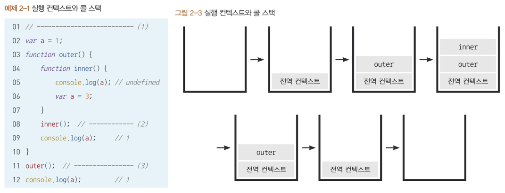

# Ch 02 실행 컨텍스트

## 1️⃣ 실행 컨텍스트란 ?

### 스택과 큐

> `스택(Stack)` : 후입선출
> 

> `큐(Queue)` : 선입선출
> 

### 기본 개념

- 실행할 코드에 제공할 **환경 정보**를 모아놓은 객체
- 동일 환경에 있는 코드들을 실행할 때 필요한 환경 정보들을 모아 컨텍스트를 구성하고, 이를 **콜 스택**에 쌓아올렸다가, 가장 위에 쌓여있는 컨텍스트와 관련 있는 코드들을 실행함.
- 실행 컨텍스트를 구성하는 방법 : **전역공간이 생성될 때, 함수가 호출될 때**

### 실행 컨텍스트가 콜 스택에 쌓이는 순서



코드 실행 시, 전역공간이 활성화되며 전역 컨텍스트가 생성되고 함수 호출 순서대로 콜스택에 실행 컨텍스트가 쌓임.

### 실행 컨텍스트에서 수집된 정보의 구성

- inner : V.E, L.E, This Binding
- outer
- 전역 컨텍스트

### 실행 컨텍스트의 inner에 담기는 정보

- VariableEnvironment (V.E)
    - 현재 컨텍스트 내의 식별자들에 대한 정보 + 외부 환경 정보.
    - 선언 시점의 LexicalEnvironment의 스냅샷으로, 변경 사항은 반영되지 ❌
- LexicalEnvironment (L.E) : 처음에는 VariableEnvironment와 같지만 변경 사항이 실시간으로 반영됨
- ThisBinding : this 식별자가 바라봐야 할 대상 객체

## 2️⃣ VariableEnvironment (V.E)

> L.E 와 다른 점 : 최초 실행 시의 스냅샷을 유지한다는 점
> 

### 기본 개념

- **변수 선언(var, let, const)** 과 관련된 정보를 저장함
- 변수 선언 시 V.E 에 해당 변수의 정보가 저장됨

### V.E 의 구성

- environmentRecord(snapshot)
- outer-EnvironmentReference(snapshot)

## 3️⃣ LexicalEnvironment (L.E) (= 정적 환경)

### 기본 개념

- 코드의 구문 구조와 관련된 정보 저장
- **함수 선언, 변수 선언** 등 코드의 구조적 정보가 저장됨
- 변수와 함수의 스코프 정보를 관리함.

### L.E 의 구성

- environmentRecord
- outer-EnvironmentReference

## 4️⃣ environmentRecord와 호이스팅

### environmentRecord ?

- **매개변수명, 선언된 함수 자체, 변수명** 등이 담김
- 컨텍스트 내부 전체를 처음부터 끝까지 순서대로 수집

### 호이스팅 ?

- 선언한 변수 및 함수가 `최상단`으로 올라가 작동하는 것
- **선언 단계에서 메모리에 저장되기 때문에 발생**함

> `변수 호이스팅`
> 

변수의 선언 위치와 상관없이 코드 내 어느 곳에서든 호출이 가능하지만 초기화는 undefined.

> `함수 호이스팅`
> 

함수의 선언 위치와 상관없이 코드 내 어느 곳에서든 호출이 가능한 것

<aside>
🤔

**함수 선언문 vs 함수 표현식**

**함수 선언문** (’function’ 키워드로 시작, 함수 이름을 명시함)
: `function add() {}` 

- **호이스팅** ✅
- 함수 이름을 가질 수 ✅ (함수 내부에서만 접근 가능)
- 스코프 : 함수 또는 전역 스코프에서 정의

**함수 표현식** (변수에 함수를 할당하는 형태)
: `var add = function() {}` 

- **호이스팅** ❌ **선언되기 전 호출 불가**
- 함수 이름을 가질 수도 있고(기명 함수), 없을 수도 있음(익명 함수)
- 스코프 : 변수의 스코프 규칙을 따름
</aside>

## 5️⃣ 스코프, 스코프 체인, outer-EnvironmentReference

### 스코프 ?

식별자에 대한 **유효 범위**
JS는 전역공간을 제외하면 `오직 함수에 의해서만` 스코프가 생성됨

### 스코프 체인 ?

식별자의 유효범위를 안에서부터 바깥으로 차례로 검색해나가는 것

> **과정**
> 

```jsx
var x = 5 // 전역 스코프

function outer() {
	var x = 10 // outer 함수 스코프
	function inner() {
		console.log(x) // 10 (outer 함수 스코프의 x)
	}
	inner()
}

outer()
console.log(x) // 5 (전역 스코프의 x)
```

1. 전역변수 x가 선언됨
2. outer() 함수 내부에서 지역 변수 x가 선언됨
3. inner() 함수 내부에서 x를 참조하면, 가장 가까운 스코프인 outer() 함수 스코프의 x를 찾아 10을 출력함
4. outer() 함수 실행이 끝나면 전역 스코프로 돌아감
5. 전역변수 x의 값인 5가 출력됨

<aside>
💡

여러 스코프에서 동일한 식별자를 선언할 경우 **스코프 체인 상에서 가장 먼저 발견된 식별자에만 접근이 가능함**

이후에 발견될 식별자에는 접근할 수 없으며 이를 `변수 은닉화` 라고 함

</aside>

### outer-EnvironmentReference

스코프 체인을 가능하게 하는 것

outer-EnvironmentReference는 바깥 Lexical Environment를 가리킴

### 전역변수와 지역변수

> `전역 변수` : **전역 공간** 에서 선언한 변수
>
> `지역 변수` : **함수 내부** 에서 선언한 변수
> 

<aside>
💡

코드의 안정성을 위해 가급적 전역변수 사용을 최소화해야 함

</aside>

## 6️⃣ this

실행 컨텍스트의 thisBinding에 this로 지정된 객체가 저장됨

실행 컨텍스트 활성화 당시 this가 지정되지 않은 경우 : this에는 전역 객체가 저장됨

함수를 호출하는 방법에 따라 this에 저장되는 대상이 다름