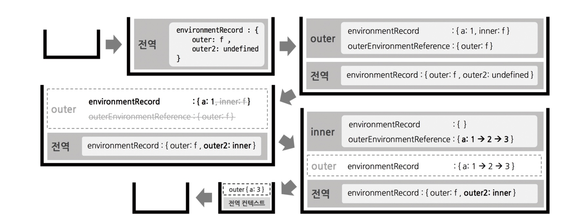

# Ch 05 클로저

## 1️⃣ 클로저의 의미 및 원리 이해

### 클로저 ?

👉🏻 어떤 함수 A에서 선언한 변수 a를 참조하는 내부함수 B를 외부로 전달할 경우 A의 실행 컨텍스트가 종료된 이후에도 변수 a가 사라지지 않아 접근 가능한 현상

> 💡 이때, ‘외부로 전달’이 곧 return 만을 의미하는 것은 아니다.
> 

### 원리

```jsx
var outer = function () {
  var a = 1;
  var inner = function () {
    console.log(++a);
  };
  inner();
};
outer();
```

→ outer 함수의 실행 컨텍스트가 종료되면 L.E에 저장된 식별자들(a, inner)에 대한 참조를 지운다. 그러면 참조하는 변수가 하나도 없게 되므로 가비지 컬렉터의 수집 대상이 될 것이다.

```jsx
var outer = function() {
  var a = 1;
  var inner = function() {
    return ++a;
  };
  return inner;        // inner 함수 자체 반환
};

var outer2 = outer();  // outer 종료, outer2는 inner 참조
console.log(outer2()); // 2
console.log(outer2()); // 3
```

- outer 함수의 실행 컨텍스트가 종료될 때, outer2 변수는 outer의 실행 결과인 inner 함수를 참조하게 된다.
- 이후 outer2를 호출하면 inner가 실행된다.
- inner 함수가 선언된 위치의 L.E가 참조복사되어, outer 함수의 L.E가 담긴다.
- 스코프 체이닝에 따라 outer에 선언한 변수 a에 접근 가능하게 된다.

> L.E에 접근할 수 있는 이유
> 

→ **가비지 컬렉터 동작 방식 때문**

가비지 컬렉터는 어떤 값을 참조하는 변수가 하나라도 있으면 그 값은 수집 대상에 포함시키지 않는다.

> 클로저 발생 시 콜스택 흐름
> 



## 2️⃣ 클로저와 메모리 관리

클로저로 인한 메모리 소모가 일부 존재하기 때문에 관리법을 잘 파악해 적용해야 한다.

그 방법으로는 **참조 카운트를 0으로** 만들면 되는데,
참조 카운트를 0으로 만드는 방법은 **식별자에 보통 null이나 undefined 를 할당**하면 된다.

## 3️⃣ 클로저 활용 사례

### 콜백 함수 내부에서 외부 데이터를 사용하고자 할 때

- 이벤트 리스너를 통한 예제

```jsx
var fruits = ['apple', 'banana', 'peach'];
var $ul = document.createElement('ul'); // (공통 코드)

fruits.forEach(function(fruit) {
  // (A)
  var $li = document.createElement('li');
  $li.innerText = fruit;
  $li.addEventListener('click', function() {
    // (B)
    alert('your choice is ' + fruit);
  });
  $ul.appendChild($li);
});
document.body.appendChild($ul);
```

→ .forEach 메서드에 넘겨준 콜백 함수(A)에서 addEventListener에 넘겨준 콜백 함수(B)에서는 fruit 이라는 외부 변수를 참조하고 있기 때문에 클로저가 있다.

클릭 이벤트에 의해 각 컨텍스트의 (B)가 실행될 때는 (B)의 outerEnvironmentReference가 (A)의 L.E 를 참조하게 된다.

따라서 (B) 함수가 참조할 예정인 변수 fruit에 대해서는 (A)가 종료된 후에도 가비지 컬렉터 수거 대상에 제외되어 계속 참조가 가능하게 될 것이다.

> (B) 함수를 **외부로 분리**할 경우
> 

```jsx
...
var alertFruit = function(fruit) {
  alert('your choice is ' + fruit);
};
fruits.forEach(function(fruit) {
  var $li = document.createElement('li');
  $li.innerText = fruit;
  $li.addEventListener('click', alertFruit);
  $ul.appendChild($li);
});
document.body.appendChild($ul);
alertFruit(fruits[1]);
```

👉🏻 마지막 줄에서는 정상적으로 출력이 되지만, 각 li를 클릭하면`[object PointEvent]` 라는 값이 출력됨.

`addEventListener`는 콜백 함수를 호출할 때 첫 번째 인자에 이벤트 객체를 주입하기 때문에 **`bind` 메서드를 활용해 해결 가능함**

> **`bind` 메서드**를 활용한 코드
> 

```jsx
...
fruits.forEach(function(fruit) {
  var $li = document.createElement('li');
  $li.innerText = fruit;
  $li.addEventListener('click', alertFruit.bind(null, fruit));
  $ul.appendChild($li);
});
...
```

👉🏻 값이 제대로 출력은 되지만 이벤트 객체가 인자로 넘어오는 순서가 바뀌고 함수 내부에서의 this 가 원래의 값과 달라지게 됨.

이를 해결하기 위해 고차함수를 활용한다.

> **고차함수**를 활용한 코드
> 

```jsx
...
var alertFruitBuilder = function (fruit) {
  return function () {
    alert('your choice is ' + fruit);
  };
};
fruits.forEach(function(fruit) {
  var $li = document.createElement('li');
  $li.innerText = fruit;
  $li.addEventListener('click', alertFruitBuilder(fruit));
  $ul.appendChild($li);
});
```

👉🏻 고차함수를 활용해 함수 내부에서 다시 익명함수를 반환
→ alertfruitBuilder 함수를 실행하면서 fruit 값을 인자로 전달
→ 함수의 실행 결과가 다시 함수가 되어 반환된 함수를 이벤트 리스너에 콜백 함수로써 전달

⇒ fruit 값을 클로저로 기억할 수 있게 됨.

### 접근 권한 제어 (정보 은닉)

> 정보 은닉
> 
- 어떤 모듈의 내부 로직에 대해 외부로의 노출을 최소화해 모듈 간의 결합도를 낮추고 유연성을 높이고자 하는 프로그래밍 언어의 중요한 개념 중 하나

> 클로저를 이용해 함수 차원에서 public 한 값과 private 한 값을 구분 가능함
> 

```jsx
var outer = function () {
  var a = 1;
  var inner = function () {
    return ++a;
  };
  return inner;        
};
var outer2 = outer();
console.log(outer2()); 
console.log(outer2());
```

👉🏻 외부 공간에서 노출돼 있는 outer 변수로 outer 함수를 실행할 수 있지만, 함수 내부에는 어떠한 개입도 불가함.

외부에서는 오직 outer 함수가 return 한 정보에만 접근할 수 있게 되어, return 값이 외부에 정보를 제공하는 유일한 수단이 됨.

> **클로저를 활용해 접근권한을 제어하는 방법**
> 
1. 함수에서 지역변수 및 내부함수 등을 생성
2. 외부에 접근권한을 주고자 하는 대상들로 구성된 참조형 데이터(대상이 여럿일 때는 객체 또는 배열, 하나일 때는 함수)를 return
→ return 한 변수들은 공개 멤버가 되고, 그렇지 않은 변수들은 비공개 멤버가 됨.

### 부분 적용 함수

> 부분 적용 함수 ?
> 
- n개의 인자를 받는 함수에 미리 `m`개의 인자만 넘겨 기억시켰다가, 나중에 `(n-m)` 개의 인자를 넘기면 비로소 원래 함수의 실행 결과를 얻을 수 있게끔 하는 함수
- 이는 `bind` 메서드를 활용해 구현 가능하지만, `this`의 값을 변경할 수 밖에 없어 메서드에서는 사용할 수 없을 것 같음.

> 부분 적용 함수 구현
> 

```jsx
var partial = function() {
  var originalPartialArgs = arguments;
  var func = originalPartialArgs[0];
  if (typeof func !== 'function') {
    throw new Error('첫 번째 인자가 함수가 아닙니다.');
  }
  return function() {
    var partialArgs = Array.prototype.slice.call(originalPartialArgs, 1);
    var restArgs = Array.prototype.slice.call(arguments);
    return func.apply(this, partialArgs.concat(restArgs));
  };
};

var add = function() {
  var result = 0;
  for (var i = 0; i < arguments.length; i++) {
    result += arguments[i];
  }
  return result;
};
var addPartial = partial(add, 1, 2, 3, 4, 5);
console.log(addPartial(6, 7, 8, 9, 10));      // 55

var dog = {
  name: '강아지',
  greet: partial(function(prefix, suffix) {
    return prefix + this.name + suffix;
  }, '왈왈, '),
};

dog.greet('입니다!');                          // 왈왈, 강아지입니다.
```

- 첫 번째 인자에는 원본 함수를, 두 번째 인자 이후부터는 미리 적용할 인자들을 전달
- 반환할 함수(부분 적용 함수)에서는 다시 나머지 인자들을 받아 이들을 한데 모아(`concat`) 원본 함수를 호출(`apply`)
- 실행 시점의 `this`를 그대로 반영함으로써 `this`에는 영향을 주지 않게 됨

> 부분 적용 함수 예시 - 디바운스
> 

**디바운스** : 짧은 시간 동안 동일한 이벤트가 많이 발생할 경우 처음 또는 마지막에 발생한 이벤트에 대해 한 번만 처리하는 것

→ 프론트엔드 성능 최적화에 큰 도움을 주는 기능 (`scroll`, `wheel`, `mousemove`, `resize` 등에 적용)

```jsx
var debounce = function (eventName, func, wait) {
  var timeoutId = null;
  return function (event) {
    var self = this;
    console.log(eventName, 'event 발생');
    clearTimeout(timeoutId);
    timeoutId = setTimeout(func.bind(self, event), wait);
  };
};

var moveHandler = function (e) {
  console.log('move event 처리');
};

var wheelHandler = function (e) {
  console.log('wheel event 처리');
};

document.body.addEventListener('mousemove', debounce('move', moveHandler, 500));
document.body.addEventListener('mousewheel', debounce('wheel', wheelHandler, 700));
```

### 커링 함수

> 커링 함수 ?
> 
- 여러 개의 인자를 받는 함수를 하나의 인자만 받는 함수로 나눠서 순차적으로 호출될 수 있게 체인 형태로 구성한 것
- 부분 적용 함수와 다른 점
    - 한 번에 하나의 인자만 전달
    - 중간 과정상의 함수를 실행한 결과는 그다음 인자를 받기 위해 대기만 할 뿐으로, 마지막 인자가 전달되기 전까지는 원본 함수가 실행되지 ❌
- 단점 : 인자가 많아질수록 가독성이 떨어짐
    - ES6에서는 화살표 함수를 써서 같은 내용을 한 줄에 표기할 수 있음

```jsx
var curry3 = function(func) {
  return function(a) {
    return function(b) {
      return func(a, b);
    };
  };
};

var getMaxWith10 = curry3(Math.max)(10);
console.log(getMaxWith10(8));            // 10
console.log(getMaxWith10(25));           // 25

var getMinWith10 = curry3(Math.min)(10);
console.log(getMinWith10(8));            // 8
console.log(getMinWith10(25));           // 10
```

> 커링 함수 - **지연 실행**
> 
- 원하는 시점까지 지연시켰다가 실행하는 상황이라면 커링 함수를 사용하기에 적합

```jsx
var getInformation = function (baseUrl) {       // 서버에 요청할 주소의 기본 URL
  return function (path) {                      // path 값
    return function (id) {                      // id 값
      return fetch(baseUrl + path + '/' + id);  // 실제 서버에 정보 요청.
    };
  };
};

// ES6
var getInformation = baseUrl => path => id => fetch(baseUrl + path + '/' + id);
```

> 커링 함수 사용 예시 - `Redux의 미들웨어`
> 

```jsx
// Redux Middleware 'Logger'
const logger = store => next => action => {
  console.log('dispatching', action);
  console.log('next state', store.getState());
  return next(action);
}
```