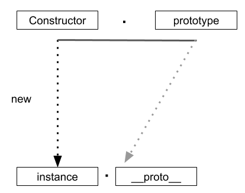
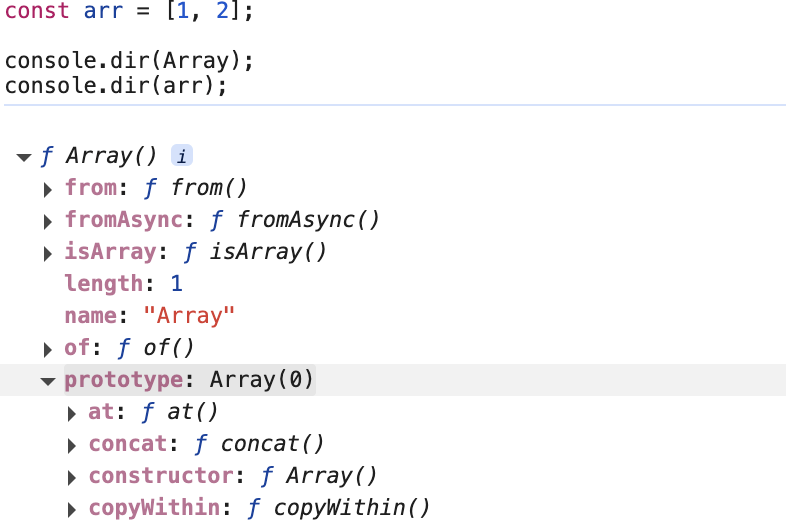
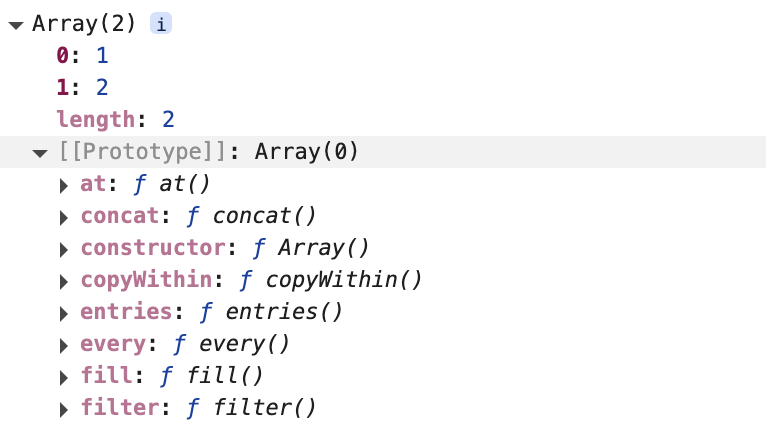
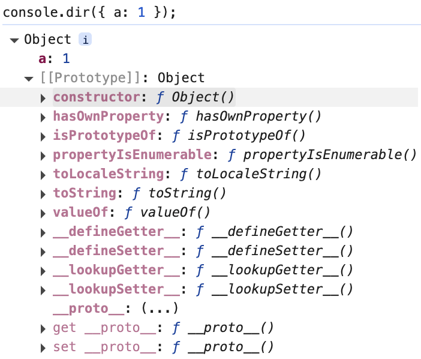
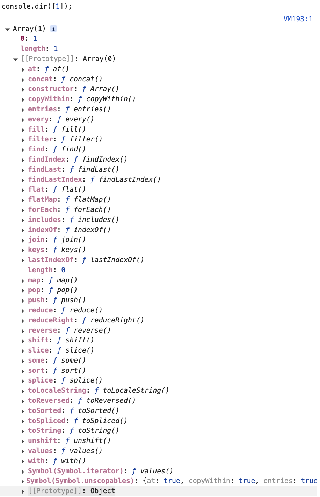
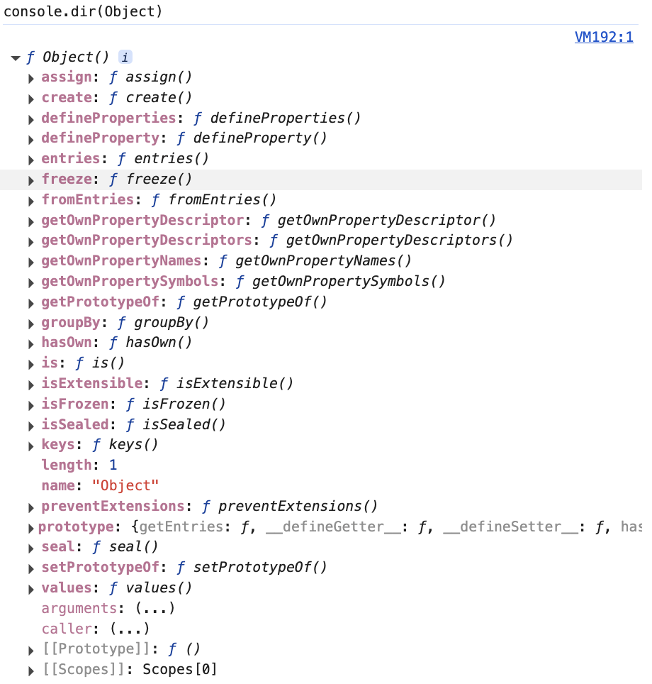
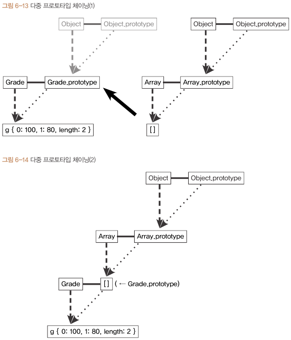

# Ch 06 프로토타입


## 0️⃣ 자바스크립트와 프로토타입

자바스크립트는 프로토타입 기반 언어

> **클래스 기반 언어**
> 
- ‘상속’을 사용
- 유명한 프로그래밍 언어의 상당수가 클래스 기반 언어

> **프로토타입 기반 언어**
> 
- 어떤 객체를 원형(prototype) 으로 삼고 이를 복제(참조)함으로써 상속과 비슷한 효과를 얻음

## 1️⃣ 프로토타입의 개념 이해



- 어떤 생성자 함수 `Constructor` 를 new 연산자와 함께 호출하면
- `Constructor` 에서 정의된 내용을 바탕으로 새로운 인스턴스 `instance` 가 생성됨.
- 이때 `instance` 에는 `__proto__` 라는 프로퍼티가 자동으로 부여되는데,
- 이 프로퍼티는 `Constructor` 의 `prototype` 이라는 프로퍼티를 참조함.

> ⚠️ **권장 사항**
> 
> - ES5.1 명세에는 __proto__ 가 아니라 [[ prototype ]] 이라는 명칭으로 정의돼 있음.
> - 명세에는 `instance.__proto__` 와 같은 직접 접근 방식은 허용하지 않고 `Object.getPrototypeOf(instance)/Refelect.getPrototypeOf(instance)` 를 통해서만 접근할 수 있도록 정의했었음.
> 
> - 결국 ES6에서는 직접 접근 방식을 브라우저에서 동작하는 레거시 코드에 대한 호환성 유지 차원에서 정식으로 인정.
> - 다만 **권장되는 방식은 아니며**, 브라우저가 아닌 다른 환경에서는 지원되지 않을 가능성이 있음
>     - 실무에서는 가급적 `__proto__` 대신 `Object.getPrototypeOf()/Object.create()` 등을 이용하도록 함.

### 코드로 자세히 알아보기

> `Person` 이라는 생성자 함수의 `prototype` 에 `getName` 이라는 메서드를 지정했다고 가정해보자.
`Person` 의 인스턴스인 `suzi` 는 `__proto__` 를 통해 `getName` 을 호출할 수 있음.
> 

```jsx
var suzi = new Person('Suzi')
suzi.__proto__.getName()  // undefined 가 출력된다!
```

- `undefined` 가 출력되는 이유?
    - `this` 바인딩 대상이 잘못됨
    - `getName` 은 메서드로서 호출되어 바인딩 대상은 `suzi` 가 아닌 `suzi.__proto__` 이고, `suzi.__proto__` 에는 `_name` 이 없어 `undefined` 가 출력됨.
- **`__proto__` 는 생략 가능한 프로퍼티** 이기 때문에, `suzi.getName()` 처럼 바로 호출 가능하며 이때 Suzi 가 정상 출력됨.

```jsx
var Person = function(name) {
    this._name = name;
};

Person.prototype.getName = function() {
    return this._name;
};

var suzi = new Person('Suzi');
console.log(suzi.getName());  // Suzi
```

### 내장 생성자 함수 Array 바탕으로 살펴보기





- Array 의 `prototype` 에 있는 메서드가 arr 의 `__proto__` 에 들어 있는 것을 확인할 수 있음.

> 💡 **프로토타입 개념 정리**
> 
- 자바스크립트는 함수에 자동으로 객체 `prototype` 프로퍼티를 생성해 놓는데, 해당 함수를 생성자 함수로서 사용할 경우, 그로부터 생성된 인스턴스에는 숨겨진 프로퍼티 `__proto__` 가 자동 생성되며, 이 프로퍼티는 생성자 함수의 `prototype` 프로퍼티를 참조함.
- `__proto__` 는 생략이 가능하여 인스턴스는 생성자 함수의 `prototype` 에 있는 메서드를 마치 자신의 것처럼 접근이 가능함

### constructor 프로퍼티

- 생성자 함수의 프로퍼티인 `prototype` 객체 내부에는 `constructor` 라는 프로퍼티가 있음.
- 이 프로퍼티는 원래의 생성자 함수(자기 자신)를 참조
- **인스턴스로부터 그 원형이 무엇인지 알 수 있는 수단** (상속 흉내가 가능해진 측면 → 이는 7장에서 다룸)
- `constructor` 는 읽기 전용 속성이 부여된 예외적인 경우(기본형 리터럴 변수 - number, string, boolean)을 제외하고는 값을 바꿀 수 있음

> **다양한 constructor 접근 방법**
> 

```jsx
// 생성자 함수 정의
function Person(name) {
  this.name = name;
}

// 생성자 함수의 prototype에 메서드 추가
Person.prototype.sayHello = function () {
  console.log(`Hello, my name is ${this.name}`)
}

// 생성자 함수의 prototype 객체의 constructor 프로퍼티 확인 방법

// 1. 직접 접근
console.log(Person.prototype.constructor === Person)  // true

// 2. 인스턴스에서 접근
var john = new Person('John')
console.log(john.constructor === Person)  // true

// 3. Object.getPrototypeOf 사용
console.log(Object.getPrototypeOf(john).constructor === Person)  // true

// 4. instanceof 연산자 사용
console.log(john instanceof Person)  // true

// 5. constructor 속성 직접 확인
console.log(john.constructor === john.__proto__.constructor)  // true
```

## 2️⃣ 프로토타입 체인

### 메서드 오버라이드

- 인스턴스가 동일한 이름의 프로퍼티나 메서드를 가지게 되면 메서드 오버라이드가 일어남.

```jsx
var Person = function (name) {
    this.name = name;
};
Person.prototype.getName = function () {
    return this.name;
};

var iu = new Person('지금');
iu.getName = function () {
    return '바로 ' + this.name;
};
console.log(iu.getName());  // 바로 지금
```

- 자바스크립트 엔진이 `getName` 이라는 메서드를 찾는 방식은
    - 가장 가까운 대상인 자신의 프로퍼티를 검색
    - 없으면 그 다음으로 가까운 대상인 `__proto__` 를 검색
    - 인스턴스인 `iu` 에 같은 이름의 `getName()` 을 추가하면 `iu` 의 프로퍼티인 `getName()` 이 호출됨
- 메서드 오버라이딩한 메서드에서도 원본에 있는 메서드를 호출할 수 있음

### 프로토타입 체인

> **객체의 내부 구조**
> 



- `__proto__` 내부에 다양한 메서드들을 포함하고 있고 `constructor` 는 생성자 함수인 `Object` 를 가리키고 있음.

> **배열의 내부 구조**
> 



- 배열을 살펴보면 `__proto__` 내부에 `constructor` 는 생성자 함수인 `Array` 를 가리키고 있는데
- `Array.prototype` 의 `__proto__` 는 Object 를 가리키고 있음.
- `__proto__` 는 생략 가능하니 배열은 `Array.prototype` 의 내부의 메서드를 마치 자신의 것처럼 실행할 수 있고
- 생략 가능한 `__proto__` 를 한 번 더 따라가면 `Object.prototype` 을 참조할 수 있음.

### 프로토타입 체이닝

- **메서드 오버라이드와 동일한 맥락**으로
- 어떤 메서드를 호출하면 자바스크립트 엔진은 데이터 자신의 프로퍼티들을 검색해
    - 원하는 메서드가 있으면 그 메서드를 실행
    - 없으면 `__proto__` 를 검색
        - 있으면 그 메서드를 실행
        - 없으면 다시 `__proto__` 를 검색해서 실행

### 객체 전용 메서드의 예외사항

- 어떤 생성자 함수이든 `prototype` 은 반드시 객체이기 때문에 `Object.prototype` 이 언제나 프로토타입 체인의 최상단에 존재함.
- 객체에서만 사용할 메서드는 다른 여느 데이터 타입처럼 프로토타입 객체 안에 정의할 수 ❌
→ 다른 데이터 타입도 해당 메서드를 사용할 수 있기 때문

- 이 같은 이유로 객체만을 대상으로 동작하는 객체 전용 메서드들은 부득이 `Object.prototype` 이 아닌 `Object` 에 스태틱 메서드로 부여할 수 밖에 없었음.
- 또한 생성자 함수인 `Object` 와 인스턴스인 객체 리터럴 사이에는 `this` 를 통한 연결이 불가능하여 전용 메서드처럼 ‘메서드명 앞의 대상이 곧 `this`’ 가 되는 방식 대신 `this` 의 사용을 포기하고 대상 인스턴스를 인자로 직접 주입 해야 하는 방식으로 구현돼 있음.

> **Object 전용 메서드**
> 



- 객체 한정 메서드 중 `freeze` 라는 메서드가 `Object.freeze(instance)` 가 아닌 `instance.freeze()` 처럼 표현할 수 있었다면
- 참조형 데이터 뿐 아니라 기본형 데이터 조차 `__proto__` 에 접근하여 `freeze()` 를 사용할 수 있었을 것임.

→ 이 때문에 자바스크립트는 예외적으로 `prototype` 내부에 정의하지 않은 메서드들이 있는 것.

### 다중 프로토타입 체인

- 자바스크립트의 기본 내장 데이터 타입들은 모두 프로토타입 체인이 1단계(객체)이거나 2단계(나머지)로 끝나는 경우만 있었지만 사용자가 새롭게 만드는 경우에는 그 이상도 얼마든지 가능함.
- 대각선의 `__proto__` 를 연결해나가기만 하면 무한대로 체인 관계를 이어나갈 수 있음.
    - 이 방법으로부터 다른 언어의 클래스와 비슷하게 동작하는 구조를 만들 수 있는데, 이는 7장에서 다룰 것임.

> **대각선의 `__proto__` 를 연결하는 방법**
> 

`__proto__` 가 가리키는 대상, 즉 **생성자 함수의 `prototype` 이 연결하고자 하는 상위 생성자 함수의 인스턴스를 바라보게** 하면 됨.

```jsx
var Grade = function () {
	var args = Array.prototype.slice.call(arguments);
	for (var i = 0; i < args.length; i++) {
		this[i] = args[i];
	}
	this.length = args.length;
};
var g = new Grade(100, 80);
```

- 변수 `g` 는 유사배열객체. 유사배열객체에 배열 메서드를 적용하는 방법으로 `call/apply` 를 사용할 수 있지만
인스턴스에서 배열 메서드를 직접 쓸 수 있게끔 해보려면,
`g__proto__` , 즉 `Grade.prototype` 이 배열의 인스턴스를 바라보게 한다.

```jsx
// 이 명령에 의해 서로 별개로 분리돼 있던 데이터가 연결되어 하나의 프로토타입 체인 형태를 띄게 됨.
Grade.prototype = [];
```

