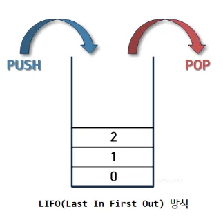

# 실행 컨텍스트

사람: 김소연
생성 일시: 2025년 3월 11일 오후 2:01
최종 편집 일시: 2025년 3월 13일 오후 2:27

# 1. 실행 컨텍스트란?

<aside>
💡

실행할 코드에 제공할 환경 정보들을 모아놓은 객체 (코드가 실행될 때 생성되는 환경)

→ 동일한 환경에 있는 코드들을 실행할 때 필요한 환경 정보들을 모아 컨텍스트를 구성하고, 이를 콜 스택에 쌓아올렸다가, 가장 위에 쌓여있는 컨텍스트와 관련 있는 코드들을 실행하는 식으로 전체 코드의 환경과 순서를 보장한다.

</aside>

- `Stack(스택)` : 출입구가 하나뿐인 우물 같은 데이터 구조



- `Queue(큐)` : 양쪽이 모두 열려있는 파이프같은 데이터 구조


# 2. VariableEnvironment

- 최초 실행 시의 스냅샷을 유지한다. (LexicalEnvironment와 차이점)
- 실행 컨텍스트를 생성할 때  VariableEnvironment에 정보를 먼저 담은 다음, 이를 그대로 복사해서 LexicalEnvironment를 만들고, 이후에는 LexicalEnvironment를 주로 활용하게 된다.

# 3. LexicalEnvironment

### 1.   environmentRecord와 호이스팅

```jsx
environmentRecord에는 현재 컨텍스트와 관련된 코드의 식별자 정보들이 저장된다.
컨텍스트를 구성하는 함수에 지정된 매개변수의 이름, 함수 선언, 변수명등이 담긴다.
```

코드가 실행되기 전에 자바스크립트 엔진은 이미 코드의 변수명들을 모두 알고 있는 상태가 된다.

🤓 호이스팅

- 코드가 실행되기 전에 변수와 함수선언이 최상단으로 끌어올려진 것 처럼 동작하는 것.

```jsx
function a () {
	console.log(b); // 1번
	
	var b = 'bbb';
	console.log(b); // 2번
	
	function b () {}
	console.log(b); // 3번
}
```

상단의 코드를 봤을 때 1번은 undefined, 2번은 ‘bbb’, 3번은 함수b가 출력 될 것이라고 생각된다.

하지만 호이스팅의 과정을 거치면 하단의 코드처럼 변하게 된다고 보면 된다.

```jsx
function a () {
	var b;
	function b () {}
	
	console.log(b); // 1번
	
	var b = 'bbb';
	console.log(b); // 2번

	console.log(b); // 3번
}
```

따라서 1번은 b함수, 2번은 ‘bbb’, 3번은 ‘bbb’가 출력 되는 것이다.

❗ 함수 선언문과 함수 표현식

```jsx
//함수 선언문
function a () {}

//함수 표현식
//익명 함수 표현식
let b = function () {}

//기명 함수 표현식
//함수 내부에서는 c(),d()모두 잘 실행 되지만, 함수 밖에서는 d()를 호출 할 경우 에러가 난다.
let c = function d () {}

c();
d(); //Uncaught ReferenceError: d is not defined
```

🤔 함수 표현식이 안전한 이유

- 함수 선언문은 전체를 호이스팅하고, 함수 표현식은 변수로 선언되어 있어서 선언부만 호이스팅한다.

```jsx
console.log(sum(1,2));
console.log(muliply(3,4));

function sum (a, b) {
	a + b
}  

let multiply = function (a, b) {
	a * b
}

//호이스팅 후
var sum = function sum (a, b) {
	a + b
}  

let multiply;

console.log(sum(1,2));
console.log(muliply(3,4));

 multiply = function (a, b) {
	a * b
}
```

만약 동일한 변수명 ‘sum’으로 함수 선언문을 작성했을 때, 서로 다른 값을 할당할 경우 나중에 할당한 값이 먼저 할당한 값을 덮어 씌우게 되면서 오류가 발생할 수 있다.

### 2. 스코프, 스코프 체인

```jsx
스코프란 식별자에 대한 유효범위이다. 오직 함수에 의해서만 스코프가 생성된다.
식별자의 유효범위를 안에서부터 바깥으로 차례로 검색해나가는 것을 스코프 체인이라고 한다.
```

여러개의 함수가 중첩되어 있는 경우 가장 가까운 요소부터 차례대로 접근할 수 있고 다른 순서로 접근하는 것은 불가능 할 것이다.

```jsx
var a = 1;
var c = 5;

var outer = function () {
	var inner = function () {
		console.log (a); // undefined  (1번)
		console.log (c); // 5
		var a = 3;
	}
	inner();
	console.log(a); // 1 (2번)
}
outer();
console.log(a); // 1 (3번)
```

(1번) inner함수 내부에서는 inner, outer, 전역 스코프 모두에 접근할 수 있다. 하지만, inner 내부에서 식별자 a에 접근하려고 하면 스코프 체인 상의  첫 번째 인자인 inner함수 내부의 a에 접근한다. 이미 inner 함수 내부에 a 식별자가 존재하므로 즉시 inner 스코프 상의 a를 반환한다.

<aside>
💡

변수의 은닉화

inner 함수 내부에서 전역 공간과 똑같은 변수를 선언 했을 경우, 전역 공간의 동일한 변수에 접근 할 수 없는 것을 말한다.

</aside>

(2번) outer함수 내부에서는 outer와 전역 스코프에서 생성된 변수에만 접근할 수 있고, inner함수 내부에는 접근할 수 없다.

(3번) 전역 공간에서는 전역 스코프에서 생성된 변수에만 접근할 수 있다.

❗ 전역 변수와 지역 변수

전역 변수 : 전역 스코프에서 선언한 a, c , outer 이다.

지역 변수 : outer함수 내부에서 선언한 inner 함수와, inner 함수 내부에서 선언한 변수 a 이다.