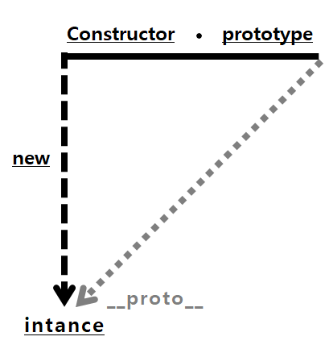
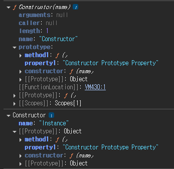
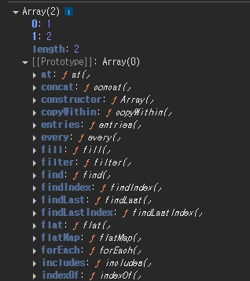
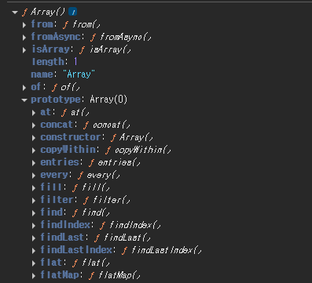
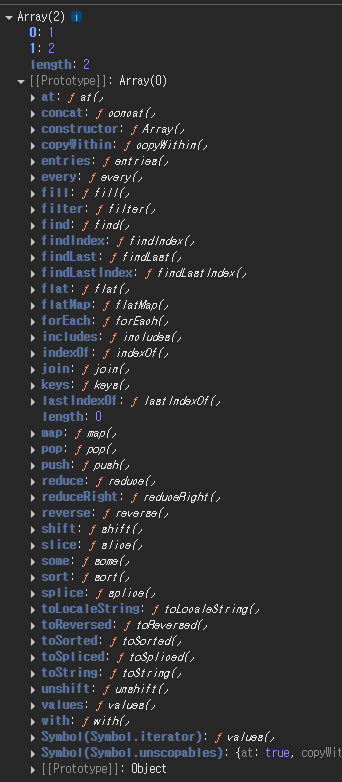

# 6장\_프로토타입

> 자바스크립트는 프로토타입 기반 언어이다.
> 클래스 기반 언어에서는 ‘상속’을 사용하지만 프로토타입 기반 언어에서는 어떤 객체를 원형으로 삼고 이를 복제(참조)함으로써 상속과 비슷한 효과를 얻는다.

## 1. constructor, prototype, instance



⇒ 위 그림을 말로 풀어내면 ‘new 연산자로 Constructor를 호출하면 instance가 만들어지고, 이 instance의 생략 가능한 프로퍼티인 \***\*proto\*\*** 는 Constructor의 prototype을 참조한다.’ 이다.

prototype은 객체이다. 이를 참조하는 \***\*proto\*\*** 역시 객체이며, prototype객체 내부에는 인스턴스가 사용할 메서드를 저장한다. 그러면 인스턴스에서도 숨겨진 프로퍼티인 \***\*proto\*\***를 통해 이 메서드들에 접근할 수 있게 된다

```jsx
var Person = function (name) {
  this._name = name;
};
Person.prototype.getName = function () {
  return this._name;
};

var suzi = new Person("Suzi");
suzi.__ ** (proto ** __.getName()); // undefined
Person.prototype === suzi.__ ** (proto ** __); // true
```

Person의 인스턴스는 \***\*proto\*\*** 프로퍼티를 통해 getName을 호출할 수 있다. instance의 \***\*proto\*\***가 Constructor의 prototype 프로퍼티를 참조하므로 같은 객체를 바라보기 때문이다.

🤔 왜 메서드 호출 결과로 undefined가 나올까?

만약 실행할 수 없는, 즉 함수가 아닌 다른 데이터 타입이었다면 TypeError가 발생했을 것이다. 그런데 값이 에러가 아닌 다른 값이 나왔으니 getName이 실제로 실행되었고, getName이 함수라는 것이 된다.

문제는 this에 바인딩된 대상이 잘못 지정되었는데, suzi.\***\*proto\*\***.getName()에서 getName 함수 내부에서의 this는 suzi가 아니라 suzi.**\*\*proto\*\***라는 객체가 되는 것이다\*\*.\*\* 객체 내부에는 name 프로퍼티가 없으므로 ‘찾고자 하는 식별자가 정의돼 있지 않을 때는 Error대신 undefined를 반환한다’ 라는 규약에 의해 undefined가 반환된 것이다.

```jsx
var Person = function(name){
	this._name = name;
}
Person.prototype.getName = function(){
	return this._name;
}

var suzi = new Person('Suzi');
suzi.__**proto**__._name = 'suzi';
suzi.__**proto**__.getName(); // suzi
```

따라서 \***\*proto\*\*** 객체에 name프로퍼티를 넣으면 잘 출력된다.

this를 인스턴스로 대체 할 수 있는데, `__**proto**__는 생략이 가능`하기 때문에 \***\*proto\*\*** 없이 인스턴스에 곧바로 메서드를 쓰면 된다.

```jsx
var suzi = new Person("Suzi", 28);
suzi.getName(); //'Suzi'
```

자바스크립트는 함수에 자동으로 객체인 prototype 프로퍼티를 생성해 놓는데, new 연산자와 함께 호출할 경우, 생성된 인스턴스에는 숨겨진 프로퍼티 인 \***\*proto\*\***가 자동으로 생성되며, 이 프로퍼티는 생성자 함수의 prototype프로퍼티를 참조한다. \***\*proto\*\***프로퍼티는 생략이 가능하기 때문에 **생성자 함수의 prototype에 어떤 메서드나 프로퍼티가 있다면 인스턴스에서도 마치 자신의 것 처럼 해당 메서드나 프로퍼티에 접근할 수 있다.**

```jsx
var Constructor = function (name) {
  this.name = name;
};
Constructor.prototype.method1 = function () {};
Constructor.prototype.property1 = "Constructor Prototype Property";

var instance = new Constructor("Instance");
console.dir(Constructor);
console.dir(instance);
```



실행 결과를 보면 글자의 색상에 차이가 있는데 이것은 { enumerable : false } 속성이 부여된 프로퍼티인지 여부에 따라 다르다. 짙은색은 열거 가능한 프로퍼티임을 의미하고, 옅은색은 열거할 수 없는 프로퍼티를 의미한다. for…in 등으로 객체의 프로퍼티 전체에 접근하고자 할 때 접근 가능 여부를 색상으로 구분지어 표기하는 것이다.

```jsx
var arr = [1, 2];
console.dir(arr);
console.dir(Array);
```



옅은색으로 length와 \***\*proto\*\***가 표기되고, \***\*proto\*\***를 열면 다양한 메서드들이 나온다. 우리가 배열에 사용하는 메서드들이 거의 모두 들어있다.



함수의 기본적인 프로퍼티들이 옅은 색으로 보이고, Array함수의 정적 메서드인 from, isArray, of등도 확인 할 수 있다. prototype을 열면 \***\*proto\*\***와 동일한 내용으로 구성되어있다.

⇒ Array를 new연산자와 함께 호출해서 인스턴스를 생성하든, 그냥 배열 리터럴을 생성하든 instance인 [1, 2]가 만들어진다. 이 인스턴스의 \***\*proto\*\***는 Array.prototype을 참조하는데, \***\*proto\*\***가 생략 가능하도록 설계돼 있기 때문에 인스턴스가 push, pop, forEach 등의 메서드를 마치 자신의 것처럼 호출할 수 있다.

한편 Array의 prototype 프로퍼티 내부에 있지 않은 from, isArray등의 메서드들은 인스턴스가 직접 호출 할 수 없고, 이들은 Array 생성자 함수에서 직접 접근해야 실행 가능하다.

## 2. constructor 프로퍼티

생성자 함수의 프로퍼티인 prototype 객체 내부에는 constructor라는 프로퍼티가 있다. 인스턴스의\***\*proto\*\*** 객체 내부에도 마찬가지로 constructor라는 프로퍼티가 있다. 이 프로퍼티는 원래의 생성자 함수(자기 자신)를 참조한다. 인스턴스로부터 그 원형이 무엇인지를 알 수 있는 수단이다.

```jsx
var arr = [1, 2];
Array.prototype.constructor === Array; // true
arr.__ ** (proto ** __.constructor) === Array; //true
arr.constructor === Array; // true

var arr2 = new arr.constructor(3, 4);
console.log(arr2); // [3, 4]
```

인스턴스의 \***\*proto\*\***가 생성자 함수의 prototype 프로퍼티를 참조하며 \***\*proto\*\***가 생략 가능하기 때문에 인스턴스에 직접 constructor에 접근할 수 있는 수단이 생긴다.

## 3. 프로토타입 체인

### 1. 메서드 오버라이드

prototype객체를 참조하는 \***\*proto\*\***를 생략하면 인스턴스는 prototype에 정의된 프로퍼티나 메서드를 자신의 것 처럼 사용할 수 있다.

만약 인스턴스가 동일한 이름의 프로퍼티 또는 메서드를 가지고 있다면 어떻게 될까?

```jsx
var Person = function (name) {
  this.name = name;
};
Person.prototype.getName = function () {
  return this.name;
};

var iu = new Person("지금");
iu.getName = function () {
  return "바로 " + this.name;
};
console.log(iu.getName()); // 바로 지금
```

iu.\***\*proto\*\***.getName이 아닌 iu 객체에 있는 getName 메서드가 호출 되었는데 이 현상을 ‘메서드 오버라이드’ 라고 한다. 메서드 위에 메서드를 덮어 씌웠다는 표현이다.

자바스크립트 엔진이 getName이라는 메서드를 찾는 방식은 가장 가까운 대상부터 찾아나가는데, \***\*proto\*\***에 있는 메서드는 검색 순서에 밀려 호출되지 않은 것이다.

🤔 만약 메서드 오바라이딩이 이뤄진 상황에서 prototype에 있는 메서드에 접근하려면 어떻게 해야 할까?

```jsx
console.log(iu.__ ** (proto ** __.getName.call(iu))); // 지금
```

→ iu.\***\*proto\*\***.getName()을 호출하면 undefined가 출력된다. this가 prototype 객체(iu.\***\*proto\*\***)를 가리키는데 prototype상에는 name이 없기 때문이다.

call이나 apply를 사용해 this가 prototype이 아닌 인스턴스를 바라보도록 바꿔주면 된다.

### 2. 프로토타입 체인

배열 내부 구조를 확인하면 \***\*proto\*\***안에 또 \***\*proto\*\***가 나오는 것을 볼 수 있다. 그 이유는 prototype 이 ‘객체’ 이기 때문이다. 기본적으로 모든 객체의 \***\*proto\*\***에는 Object.prototype이 연결된다.



\***\*proto\*\***는 생략 가능하기 때문에 배열이 Array.prototype 내부의 메서드를 자신의 것처럼 실행할 수 있다. 마찬가지로 Object.prototype 내부의 메서드도 자신의 것처럼 실행 할 수 있다. 생략 가능한 \***\*proto\*\***를 한 번 더 따라 가면 Object.prototype을 참조 할 수 있기 때문이다

어떤 데이터의 \***\*proto\*\*** 프로퍼티 내부에 다시 \***\*proto\*\*** 프로퍼티가 연쇄적으로 이어진 것을 `프로토타입 체인` 이라고 하고, 이 체인을 따라가며 검색하는 것을 `프로토타입 체이닝` 이라고 한다.

포로토타입 체이닝은 메서드 오버라이드와 동일한 맥락이다. 어떤 메서드를 호출하면 자바스크립트 엔진은 데이터 자신의 프로퍼티들을 검색해서 원하는 메서드가 있으면 실행하고, 없으면 \***\*proto\*\***를 검색해서 있으면 그 메서드를 실행하는 방식으로 진행한다.

```jsx
var arr = [1, 2];
Array.prototype.toString.call(arr); // 1, 2
Object.prototype.toString.call(arr); // [object Array]
arr.toString(); // 1, 2

arr.toString = function () {
  return this.join("_");
};
arr.toString(); // 1_2
```

arr 변수는 배열이므로 arr. \***\*proto\*\*** 는 Array.prototype을 참조하고, Array.prototype은 객체이므로 Array.prototype. \***\*proto\*\*** 는 Object.prototype을 참조할 것이다.

### 3. 객체 전용 메서드의 예외사항

어떤 생성자 함수이든 prototype은 반드시 객체이기 때문에 Object.prototype이 언제나 프로토타입 체인의 최상단에 존재하게 된다. 따라서 객체에서만 사용할 메서드는 다른 여느 데이터 타입 처럼 프로토타입 객체 안에 정의할 수가 없다. 객체에서만 사용할 메서드를 Object.prototype 내부에 정의한다면 다른 데이터 타입도 해당 메서드를 사용할 수 있게 되기 때문이다

```jsx
Object.prototype.getEntries= function(){
	var res = [];
	for( var prop in this ){
		if(this.hasOwnProperty(prop)){
			res.push([prop, this[prop]])
		}
	}
	return res;
}
var data = [
	['object', {a : 1, b : 2, c : 3}], // [['a', 1], ['b', 2], ['c', 3]]
	['number', 345], // []
	['string', 'abc'], // [['0', 'a'], ['1', 'b'], ['2', 'c']]
	['boolean', false], // []
	['func', function(){}], // []
	['array', [1,2,3] // [['0', 1], ['1', 2], ['2', 3]]
]
data.forEach(function(datum){
	console.log(datum[1],getEntries());
})
```

객체가 아닌 다른 데이터 타입에 대해서는 오류가 나와야 하는데, 어떤 데이터 타입이건 프로토타입 체이닝을 통해 getEntires 메서드에 접근 할 수 있기 때문에 오류가 나지 않는다.

이 같은 이유로 객체만을 대상으로 동작하는 객체 전용 메서드들은 Object에 스태텍 메서드로 부여할 수밖에 없다. 또한 생성자 함수인 Object와 인스턴스인 객체 리터럴 사이에는 this를 통한 연결이 불가능하기 때문에 this의 사용을 포기하고 대상 인스턴스를 인자로 직접 주입해야 하는 방식으로 구현돼 있다.

Object.prototype이 참조형 데이터뿐 안니라 기본형 데이터 조차 \***\*proto\*\***에 반복 접근함으로써 도달할 수 있는 최상위 존재이기 때문이다.

반대로 같은 이유로 Object.prototype에는 어떤 데이터에서도 활용할 수 있는 범용적인 메서드들만 있다. toString, hasOwnProperty, valueOf, isPrototypeOf 등은 모든 변수가 마치 자신의 메서드인 것처럼 호출할 수있다.

### 4. 다중 프로토타입 체인

대각선의 \***\*proto\*\***를 연결해나가기만 하면 무한대로 체인관계를 이어나갈 수 있다.

대각선의 \***\*proto\*\***를 연결하는 방법은 \***\*proto\*\***가 가리키는 대상, 즉 생성자 함수의 prototype이 연결하고자 하는 상위 생성자 함수의 인스턴스를 바라보게끔 해주면 된다.

```jsx
var Grade = function () {
  var args = Array.prototype.slice.call(arguments);
  for (var i = 0; i < args.length; i++) {
    this[i] = args[i];
  }
  this.length = args.length;
};

var g = new Grade(100, 80);
```

변수 g는 Grade의 인스턴스를 바라본다. Grade의 인스턴스는 여러 개의 인자를 받아 각 순서대로 인덱싱해서 저장하고 length 프로퍼티가 존재하는 등으로 배열의 형태를 지니지만, 배열의 메서드를 사용할 수 없는 유사배열객체이다.

인스터스에서 배열 메서드를 직접 쓸 수 있게끔 하고 싶으면, g.\***\*proto\*\***,즉 Grade.prototype이 배열의 인스턴스를 바라보게 하면 된다.

```jsx
Grade.prototype = [];
```

서로 별개로 분리되어 있던 데이터가 연결되어 하나의 프로토타입 체인 형태를 띠게 된다.

```jsx
console.log(g);
g.pop();
console.log(g);
g.push(90);
console.log(g);
```

g 인스턴스의 입장에서 프로토타입 체인에 따라 g 객체 자신이 지니는 멤버, Grade의 prototype에 있는 멤버, Array.prototype에 있는 멤버, Object.prototype에 있는 멤버까지 접근할 수 있게 된다.
