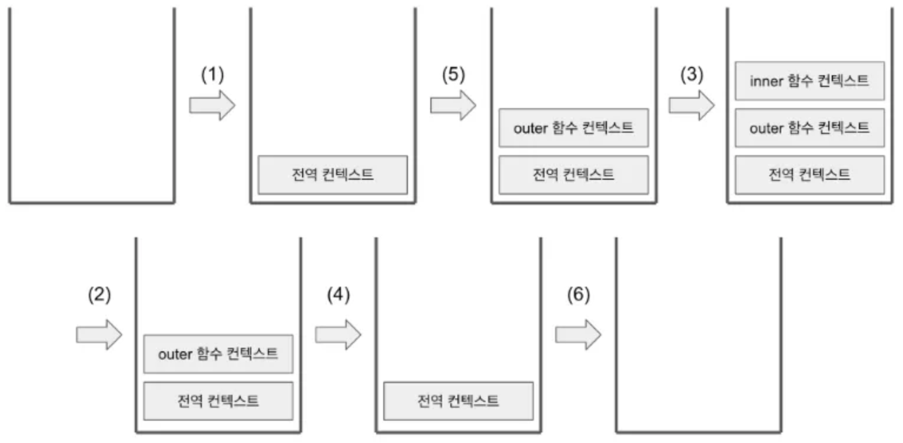
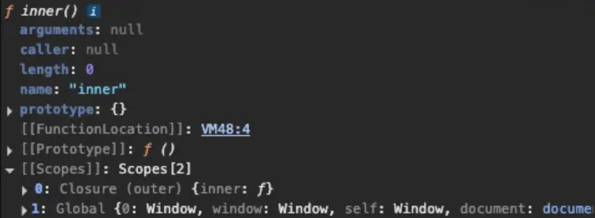
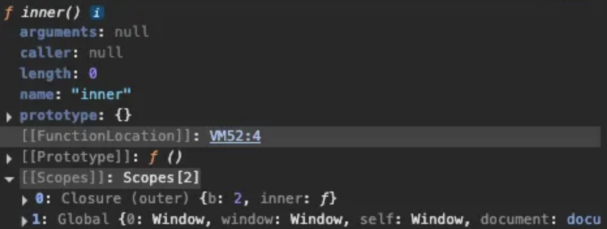

내가 이 내용이 알 듯 말 듯할 때 이 내용을 보러 온다면, 결론만 봐도 기억이 상기될 것이다. 그러므로 결론부터 써보겠다. 

## 결론

- 실행 컨텍스트
    - 실행할 코드에 제공할 환경 정보들을 모아놓은 객체
    - 전역 공간에서 자동으로 생성되는 전역 컨텍스트와 eval 및 함수 실행에 의한 컨텍스트 등이 있음
    - 활성화되는 시점에 VariableEnvironment, LexicalEnvironment, ThisBinding 이 세 가지 정보를 수집
- 실행 컨텍스트를 생성할 때
    - VariableEnvironment와 LexicalEnvironment가 동일한 내용으로 구성, LexicalEnvironment는 함수 실행 도중 변경 사항 즉시 반영
    - LexicalEnvironment
        - environmentRecord: 매개변수명, 변수의 식별자, 선언한 함수의 함수명 등을 수집
        - outerEnvironmentReference: 바로 직전 컨텍스트의 LexicalEnvironment 정보를 참조
- 호이스팅
    - 코드 해석을 좀 더 수월하게 하기 위해 environmentRecord의 수집 과정을 추상화한 개념
    - 실행 컨텍스트가 관여하는 코드 집단의 최상단으로 이들을 ‘끌어올린다’는 해석
    - 선언부만을 호이스팅, 할당 과정은 원래 자리에 유지 → 이 부분에서 함수 선언문과 함수 표현식의 차이 발생
- 스코프
    - 변수의 유효범위
    - outerEnvironmentReference는 해당 함수가 선언된 위치의 LexicalEnvironment 참조
    - 어떤 변수에 접근 → 현재 컨텍스트의 LexicalEnvironment를 탐색 후 존재 시 그 값 반환 → 없으면 outerEnvironmentReference에 담긴 LexicalEnvironment를 탐색
    - 전역 컨텍스트의 LexicalEnvironment에도 없다면 undefined 반환
- 전역변수와 지역변수
    - 전역변수: 전역 컨텍스트의 LexicalEnvironment에 담긴 변수
    - 지역변수: 함수에 의해 생성된 실행 컨텍스트의 변수
    - 안전한 코드 구성을 위해 전역변수 사용은 최소화
- this
    - 실행 컨텍스트를 활성화하는 당시에 지정된 this가 저장
    - 함수를 호출하는 방법에 따라 그 값이 달라짐
    - 지정되지 않은 경우에 전역 객체 저장

## 1. 실행 컨텍스트란?

- 스택과 큐
    - 스택: 출입구가 하나뿐인 깊은 우물 같은 데이터 구조
    - 큐: 양쪽이 모두 열려있는 파이프
- 실행 컨텍스트: 실행할 코드에 제공할 환경 정보들을 모아놓은 객체
    - 동일한 환경에 있는 코드들을 실행할 때 필요한 환경 정보들을 모아 컨텍스트를 구성 후 콜 스택에 쌓아 올림
        - 동일환 환경: 하나의 실행 컨텍스트를 구성할 수 있는 방법(전역공간, eval() 함수, 함수 등)
    - 가장 위에 쌓여있는 컨텍스트와 관련 있는 코드들을 실행하는 식으로 전체 코드의 환경과 순서 보장
    - 전역공간은 자동 생성, 우리가 실행 컨텍스트를 구성하는 방법은 함수를 실행하는 것
- 예제 2-1. 실행 컨텍스트와 콜 스택(어떤 순서로 쌓이고, 어떤 순서로 코드 실행에 관여하는지 보기)
    
    ```jsx
    // ----------------------------------------------(1)
    var a = 1;
    function outer() {
    	function inner() {
    		console.log(a); //undefined
    		var a = 3;
    	}
    	inner(); // ---------------------------------(2)
    	console.log(a); // 1
    }
    outer(); // -------------------------------------(3)
    console.log(a); // 1
    ```
    
    
    
    1. 자바스크립트 코드를 실행하는 순간 - 전역 먼텍스트가 콜 스택에 담김
        
        최상단의 공간은 코드 내부에서 별도의 실행 명령 없이도 브라우저에서 자동 실행
        
    2. 전역 컨텍스트와 관련된 코드들을 순차로 진행
    3. (3)에서 outer 함수를 호출
    4. 자바스크립트 엔진은 outer에 대한 환경 정보 수집, outer 실행 컨텍스트를 생성 후 콜스택에 담음
    5. outer 함수 내부의 코드들을 순차로 실행
    6. (2)에서 inner 함수의 실행 컨텍스트가 콜 스택에 담김
    7. outer 컨텍스트 잠시 중단 후 inner 함수 내부의 코드를 순서대로 진행
    8. inner 함수 내부에서 a 변수에 값 3을 할당 후 inner 함수 종료 → 실행 컨텍스트가 콜 스택에서 제거
    9. 아래에 있던 outer 컨텍스트가 중단됐던 (2)의 다음 줄부터 이어서 실행
    10. a 출력 후 outer 함수 실행 종료 → 실행 컨텍스트가 콜 스택에서 제거
    11. 전역 컨텍스가 중단됐던 (3)의 다음 줄부터 이어서 실행
    12. a 변수의 값 출력 후 전역 컨텍스트 제거, 콜 스택에는 아무것도 안 남음 → 종료
- 위 예제를 통해 한 실행 컨텍스트가 콜 스택의 맨 위에 쌓이는 순간이 현재 실행할 코드에 관여하게 되는 시점인 것을 알 수 있음
- JS엔진은 실행 컨텍스트가 활성화될 때 다음 정보를 담아 실행 컨텍스트 객체에 담음
    - VariableEnvironment: 현재 컨텍스트 내의 식별자들에 대한 정보 + 외부 환경 정보. 선언 시점의 LexicalEnvironment의 스냅샷으로, 변경 사항은 반영되지 않음
    - LexicalEnvironment: 처음에는 VariableEnvironment와 같지만 변경 사항이 실시간으로 반영됨
    - ThisBinding: this 식별자가 바라봐야 할 대상 객체

## 2. VariableEnvironment

- LexicalEnvironment와 같지만 최초 실행 시의 스냅샷을 유지한다는 점이 다름
- VariableEnvironment를 먼저 만들고, 그대로 복사해 LexicalEnvironment를 만들고, 이후에 LexicalEnvironment를 주로 활용
- VariableEnvironment와 LexicalEnvironment의 내부는 environmentRecord와 outer-EnvironmentReference로 구성

## 3. LexicalEnvironment

- 컨텍스트를 구성하는 환경 정보들을 사전에서 접하는 느낌으로 모아놓은 것

### 2-3-2. environmentRecord 호이스팅

- environmentRecord에는 현재 컨텍스트와 관련된 코드의 식별자 정보들이 저장
- 컨텍스트를 구성하는 함수에 지정된 매개변수 식별자, 선언한 함수가 있을 경우 그 함수 자체, var로 선언된 변수의 식별자 등이 식별자에 해당
- 내부 전체를 처음부터 끝까지 훑으며 순서대로 수집

> 💡 전역 실행 컨텍스트
    
    - 변수 객체를 생성하는 대신 자바스크립트 구동 환경이 별도로 제공하는 객체, 즉 전역 객체를 활용
    - 전역 객체에는 브라우저의 window, Node.js의 global 객체 등이 있음
    - 이들은 자바스크립트 내장 객체가 아닌 호스트 객체로 분류

- 변수 정보를 수집하는 과정을 모두 마쳤더라도 아직 실행 컨텍스트가 관여할 코드들은 실행되기 전의 상태
- 즉, 코드가 실행되기 전에도 JS엔진은 이미 해당 환경에 속한 코드의 변수명들을 모두 알게되는 것
- 위를 통해 JS 엔진은 식별자들을 최상단으로 끌어 올려놓은 다음 코드를 실행한다고 봐도 무방하다.
- 이 때 호이스팅 개념 등장: 끌어올리다라는 의미를 가진 hoist에 ing를 붙인 동명사
    - 변수 정보를 수집하는 과정을 더욱 이해하기 쉬운 방법으로 대체한 가상의 개념
    - 편의상 끌어 올린 것으로 간주하자는 것
- 호이스팅 규칙
    - 예제 2-2. 매개변수와 변수에 대한 호이스팅(1) - 원본 코드
        
        ```jsx
        function a (x) {    // 수집 대상 1(매개변수)
        	console.log(x); // (1)
        	var x;          // 수집 대상 2(변수 선언)
        	console.log(x); // (2)
        	var x = 2;      // 수집 대상 3(변수 선언)
        	console.log(x); // (3)
        }
        a(1)
        ```
        
    - 위 예제를 호이스팅 없이 실행된다고 생각해보자
    → (1): 1, (2): undefined, (3): 2
    
    > ❗ JS 엔진의 구동 방식을 좀 더 사람 입장에서 이해해보고자 코드를 변경할 것임. 혼동 X
    
    - 다음 예제 2-3은 LexicalEnvironment 입장에서 완전히 같은 코드
    - 인자를 함수 내부의 다른 코드보다 먼저 선언 및 할당이 이루어진 것으로 간주
    - 예제 2-3. 매개변수와 변수에 대한 호이스팅 (2) - 매개변수를 변수 선언/할당과 같다고 간주해 변환한 상태
        
        ```jsx
        function a () {  
        	var x = 1;      // 수집 대상 1(매개변수)
        	console.log(x); // (1)
        	var x;          // 수집 대상 2(변수 선언)
        	console.log(x); // (2)
        	var x = 2;      // 수집 대상 3(변수 선언)
        	console.log(x); // (3)
        }
        a(1)
        ```
        
    - 이 상태에서 호이스팅을 처리해보자.
    - environRecord는 현재 실행될 컨텍스트의 대상 코드 내에 선언문만 관심이 있음(할당 X)
    - 그러므로 할당 과정은 그대로 남겨둠
    - 그렇게 호이스팅을 적용한 코드는 다음과 같음
    - 예제 2-4. 매개변수와 변수에 대한 호이스팅 (3) - 호이스팅을 마친 상태
        
        ```jsx
        function a (x) {
        	var x;          // 수집 대상 1의 변수 선언 부분
        	var x;          // 수집 대상 2의 변수 선언 부분
        	var x;          // 수집 대상 3의 변수 선언 부분
        	
        	var x = 1;      // 수집 대상 1(매개변수)
        	console.log(x); // (1)
        	console.log(x); // (2)
        	var x = 2;      // 수집 대상 3(변수 선언)
        	console.log(x); // (3)
        }
        a(1)
        ```
        
    - 위 코드를 이제 실행해보자(this 무시, 3장에서 자세히 다룸)
        1. 2번째 줄: 변수 x 선언. 메모리에서는 저장할 공간을 미리 확보, 확보한 공간의 주솟값을 변수 x에 연결
        2. 3번째 줄과 4번째 줄: 변수 x 선언, 이미 변수 x가 선언되어 있으므로 무시
        3. 6번째 줄: x에 1을 할당, 숫자 1을 별도의 메모리에 담고, x와 연결된 메모리 공간에 숫자 1을 가리키는 주솟값 입력
        4. 7번째 줄과 8번째 줄: 각 x 출력, (1), (2) 모두 1 출력
        5. 9번째 줄: x에 2 할당, 숫자 2를 별도의 메모리에 담고, 주솟값을 x와 연결된 메모리 공간에 숫자 1을 가리키는 주솟값에서 대치
        6. 10번째 줄: x 출력, (3)에선 2가 출력, 모든 코드 실행 → 실행 컨텍스트가 콜 스택에서 삭제
    - 예제 2-5. 함수 선언의 호이스팅(1) - 원본 코드
        
        ```jsx
        function a () {
        	console.log(b);          // (1)
        	var b = 'bbb';           // 수집 대상 1(변수 선언)
        	console.log(b);          // (2)
        	function b () { }        // 수집 대상 2(함수 선언)
        	console.log(b);          // (3)
        }
        a();
        ```
        
    - 함수 선언은 함수 전체를 끌어올림
    - 위 코드를 호이스팅하면 다음과 같은 형태로 변환됨
    - 예제 2-6. 함수 선언의 호이스팅(2) - 호이스팅을 마친 상태
        
        ```jsx
        function a () {
        	var b;                   // 수집 대상 1. 변수 선언부만 호이스팅
        	function b () { }        // 수집 대상 2. 함수 선언은 전체를 호이스팅
        	
        	console.log(b);          // (1)
        	b = 'bbb';               // 수집 대상 1(변수 선언)
        	console.log(b);          // (2)
        	console.log(b);          // (3)
        }
        a();
        ```
        
    - 호이스팅이 끝난 상태에서의 함수 선언문은 함수명으로 선언한 변수에 함수에 할당한 것처럼 여길 수 있음
    - 예제 2-7. 함수 선언의 호이스팅 (3) - 함수 선언문을 함수 표현식으로 바꾼 코드
        
        ```jsx
        function a () {
        	var b;                   // 수집 대상 1. 변수 선언부만 호이스팅
        	var b = function b () { }// <-- 바뀐 부분
        	
        	console.log(b);          // (1)
        	b = 'bbb';               // 수집 대상 1(변수 선언)
        	console.log(b);          // (2)
        	console.log(b);          // (3)
        }
        a();
        ```
        
    - 이제 코드를 실행해보자.
        1. 2번째 줄: 변수 b를 선언, 메모리에서 저장 공간 미리 화고, 주솟값을 변수 b에 연결
        2. 3번째 줄: 다시 변수 b 선언, 선언 과정은 무시, 함수는 별도의 메모리에 담기고 그 함수가 저장된 주솟값을 b와 연결된 공간에 저장
        3. 5번째 줄: 변수 b에 할당한 함수 b를 출력
        4. 6번째 줄: 변수 b에 ‘bbb’를 할당, b와 연결된 메모리 공간에는 ‘bbb’가 담긴 주솟값으로 덮어씀
        5. 7번째 줄과 8번째 줄: (2)와 (3) 모두 ‘bbb’가 출력, 실행 컨텍스트가 콜 스택에서 제거
- 함수 선언문과 함수 표현식
    - 둘 모두 새로운 함수를 정의할 때 쓰이는 방식
    - 함수 표현식: function을 별도의 변수에 할당하는 것, 함수명이 없어도 됨
    - 함수 선언문: function 정의부만 존재, 별도의 할당 명령이 없음, 함수명 정의
    - 함수명을 정의한 함수 표현식을 **기명 함수 표현식,** 정의하지 않은 것을 **익명 함수 표현식**
    - 일반적으로 함수 표현식은 익명 함수 표현식을 말함
    - 예제 2-8. 함수를 정의하는 세 가지 방식
        
        ```jsx
        function a () { /*...*/ }      // 함수 선언문, 함수명 a가 곧 변수명.
        a(); // 실행 OK
        
        var b = function () { /*...*/ }// (익명) 함수 표현식, 변수명 b가 곧 함수명
        b(); // 실행 OK
        
        var c = function d() { /*,,,*/ }// 기명 함수 표현식, 변수명은 c, 함수명은 d
        c(); // 실행 OK
        d(); // 에러!
        ```
        
    > ❗ 기명 함수 표현식 주의할 점
            
        - 외부에서 함수명으로 함수를 호출할 수 없음
        - 함수명은 오직 함수 내부에서만 접근 가능
        - 과거에는 기명 함수 표현식 함수명이 잘 출력됐던 반면 익명 함수 표현식은 undefined 또는 unnamed라는 값이 나왔음 << 익명 함수 표현식을 추적하기에 어려움
        - 현재는 익명 함수 표현식의 변수명을 함수의 name 프로퍼티에 할당 << 위 문제 해결
        - c() 내부에서는 d()로 호출 가능 << 재귀를 위한 것인데, 굳이?
    
    - 예제 2-9. 함수 선언문과 함수 표현식 (1) - 원본 코드
        
        ```jsx
        console.log(sum(1, 2));
        console.log(multiply(3, 4));
        
        function sum (a, b) {          // 함수 선언문 sum
        	return a + b;
        }
        
        var multiply = function (a, b) { // 함수 표현식 multiply
        	return a & b;
        }
        ```
        
    - 위 코드의 호이스팅된 최종 상태를 확인해보자
    - 예제 2-10. 함수 선언문과 함수 표현식 (2) - 호이스팅을 마친 상태
        
        ```jsx
        var sum = function sum (a, b) { // 함수 선언문은 전체를 호이스팅
        	return a + b;
        };
        var multiply; // 변수는 선언문만 호이스팅
        console.log(sum(1, 2));
        console.log(multiply(3, 4));
        
        multiply = function (a, b) { // 변수의 할당부는 그 자리에
        	return a * b;
        }
        ```
        
    - 함수 선언문은 전체를 호이스팅했지만, 함수 표현식은 선언부만 호이스팅
    - 위 코드를 이제 실행해보자
        1. 1번째 줄: 메모리 공간 확보, 확보된 공간의 주솟값을 변수 sum에 연결
        2. 4번째 줄: 또 다른 메모리 공간을 확보하고 그 공간의 주솟값을 변수 multiply에 연결
        3. 1번째 줄(다시): sum 함수를 또 다른 메모리 공간에 저장, 주솟값을 변수 sum에 할당
        4. 5번째 줄: sum 실행, 정상적 실행(3)
        5. 6번째 줄: multiply에는 값이 없음, multiply is not a function 에러 발생, 에러로 런타임 종료
    - 위는 큰 혼란을 일으킬 수 있음(극단적인 예시: 100번째 줄에 함수 선언문으로 sum, 5000번째 줄에 다른 방식의 함수 선언문으로 sum << 스스로 생각해보기)

### 2-3-2. 스코프, 스코프 체인, outerEnvironmentReference

- 스코프: 식별자에 대한 유효 범위
- 스코프 체인: 식별자의 유효범위를 안에서부터 바깥으로 차례로 검색해나가는 것
- ES5까지의 JS는 전역공간을 제외하고 오직 함수에 의해서만 스코프가 생성됨
- 스코프 체인을 가능케하는 것이 LexicalEnvironment의 두 번째 수집 자료인 outerEnvironmentReference이다.
- 스코프 체인
    - outerEnvironmentReference는 현재 호출된 함수가 **선언될 당시**의 LexicalEnvironment를 참조
    - ‘선언하다’라는 행위가 실제로 일어날 수 있는 시점이란 콜 스택 상에서 어떤 실행 컨텍스트가 활성화된 상태일 뿐 << 어떤 함수를 선언(정의)하는 행위 자체도 하나의 코드, 모든 코드는 실행 컨텍스트가 활성화 상태일 때 실행되기 때문
    - outerEnvironmentReference는 연결리스트 형태를 띔
    - ‘선언 시점의 LexicalEnvironment’를 계속 찾아 올라가면 마지막엔 전역 컨텍스트의 LexicalEnvironment가 있을 것
    - 각 outerEnvironmentReference는 오직 자신이 선언된 시점의 LexicalEnvironment만 참조하고 있으므로 가장 가까운 요소부터 차례대로만 접근 가능, 다른 순서로는 불가능
    - 여러 스코프에서 동일한 식별자를 선언한 경우에는 무조건 스코프 체인 상에서 가장 먼저 발견된 식별자에게만 접근 가능
    - 예제 2-11. 스코프 체인
        
        ```jsx
        var a = 1;
        var outer = function () {
        	var inner = function () {
        		console.log(a);
        		var a = 3;
        	};
        	inner();
        	console.log(a);
        };
        outer();
        console.log(a);
        ```
        
    - 위 코드를 한 번 설명해보자(this 부분은 무시, 3장에서 배우면 보러 오기)
        1. 시작: 전역 컨텍스트 활성화, 전역 컨텍스트의 environmentRecord에 { a, outer } 식별자 저장, 전역 컨텍스트는 선언 시점이 없으므로 전역 컨텍스트의 outerEnvironment-Reference에는 아무것도 담기지 않음
        2. 1번째 줄과 2번째 줄: 전역 스코프에 있는 변수 a에 1을, outer에 함수 할당
        3. 10번째 줄: outer 함수 호출, 전역 컨텍스트의 코드는 10번째 줄에서 임시 중단, outer 실행 컨텍스트가 활성화
        4. 2번째 줄: outer 실행 컨텍스트의 environmentRecord에 { inner } 식별자를 저장, outerEnvironmentReference에는 outer 함수가 선언될 당시의 LexicalEnvironment가 담김, outer 함수는 전역 공간에서 선언됐으므로 전역 컨텍스트의 LexicalEnvironment를 참조복사,
        위를 `[ GLOBAL, { a, outer } ]` 라고 표기, 첫 번째는 실행 컨텍스트의 이름, 두 번째는 environmentRecord 객체(this: 전역 객체)
        5. 3번째 줄: outer 스코프에 있는 변수 inner에 함수 할당
        6. 7번째 줄: inner 함수 호출, outer 실행 컨텍스트는 7번째 줄에서 임시 중단 및 inner 실행 컨텍스트가 활성화
        7. 3번째 줄: inner 실행 컨테긋트의 environmentRecord에 { a } 식별자 저장, outerEnvironmentReference에는 inner 함수가 선언될 당시의 LexicalEnvironment가 담김,
        inner함수는 outer 함수 내부에서 선언됐으므로 outer 함수의 LexicalEnvironment, 즉 [ outer, { inner } ]를 참조 복사(this: 전역 객체)
        8. 4번째 줄: 식별자 a에 접근, 현재 활성화 상태인 inner 컨텍스트의 environmentRecord에서 a 검색, a를 발견했으나 할당된 값이 없음(undefined)
        9. 5번째 줄: inner 스코프에 있는 변수 a에 3을 할당
        10. 6번째 줄: inner 함수 실행 동료, inner 실행 컨텍스트가 콜 스택에서 제거, outer 실행 컨텍스트 다시 활성화, 중단됐던 7번째 줄의 다음으로 이동
        11. 8번째 줄: 식별자 a에 접근, 활성화된 실행 컨텍스트의 LexicalEnvironment에 접근, 첫 요소의 environmentRecord에서 a가 있는지 찾아보고, 없으면 outerEnvieonmentReference에 있는 environmentRecord로 넘어가는 식으로 계속해서 검색, 전역 LexicalEnvironment에 a 발견 및 1을 반환 및 출력
        12. 9번째 줄: outer 함수 실행 종료, outer 실행 컨텍스트가 콜 스택에서 제거, 전역 컨텍스트가 다시 활성화, 중단했던 10번째 줄의 다음으로 이동
        13. 11번째 줄: 식별자 a에 접근, 현재 활성화 상태인 전역 컨텍스트의 environmentRecord에서 a 검색, a 발견 및 출력, 모든 코드 실행 완료 및 종료
    - 위 설명을 간략하게 요약한 표
        
        추후 사진 추가
        
        - 위 표로 전역 컨텍스트 → outer 컨텍스트 → Inner 컨텍스트 순으로 규모가 작아지지만, 스코프 체인을 타고 접근 가능한 변수의 수는 늘어나는 것을 알 수 있음
    - 스코프 체인 상에 있는 변수라고 무조건 접근 가능한 것은 아님
    - 식별자 a는 전역 공간에서와 inner 함수 내부에서 선언
    - inner 함수 내부에서 a에 접근 시 스코프 체인 상의 첫 번째 인자, 즉 inner 스코프의 LexicalEnvironment부터 검색
    - a가 존재하기에 그 a를 반환 → inner 함수 내부에선 전역 스코프의 a에 접근할 수 없음(**변수 은닉화**)
    
    > ❗ 참고
        
        스코프 정보들을 크롬 콘솔에서 확인해보자.
    
    ```jsx
    var a = 1;
    var outer = function () {
        var b = 2;
        var inner = function () {
            console.dir(inner);
        };
        inner();
    };
    outer();
    ```
        
    
        
        여기서 재밌는 점은, 함수 내부에서 실제로 호출할 외부 변수들의 정보만 보여준다는 것. outer 스코프에 inner 변수만 노출되는데, inner 함수 내부에서 b 변수 호출을 추가한 코드에서는 b도 노출됨 (아마 브라우저 성능 향상을 위한 것)
        
    ```jsx
    var a = 1;
    var outer = function () {
        var b = 2;
        var inner = function () {
            console.log(b);
            console.dir(inner);
        };
        inner();
    };
    outer();
    ```
        
    
        
        제대로된 정보를 얻기 위해서는 console.dir 대신 debugger를 사용해보자
        
    ```jsx
    var a = 1;
    var outer = function () {
        var b = 2;
        var inner = function () {
            console.log(b);
            debugger;
        };
        inner();
    };
    outer();
    ```
    
- 전역변수와 지역변수
    - 전역변수: 전역 스코프에서 선언한 변수들
    - 지역변수: 함수 내부에서 선언한 변수들
    - 코드의 안정성을 위해 가급적 전역변수 사용을 최소화하기

## 4. this

- thisBinding에는 this로 지정된 객체가 저장
- 실행 컨텍스트 활성화 당시에 this가 지정되지 않으면 this에는 전역 객체가 저장
- 함수를 호출하는 방법에 따라 this에 저장되는 대상이 다름
- 자세한 내용은 3장에서.