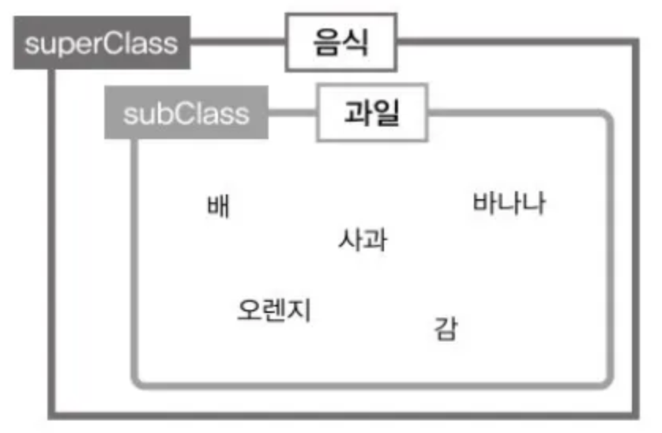
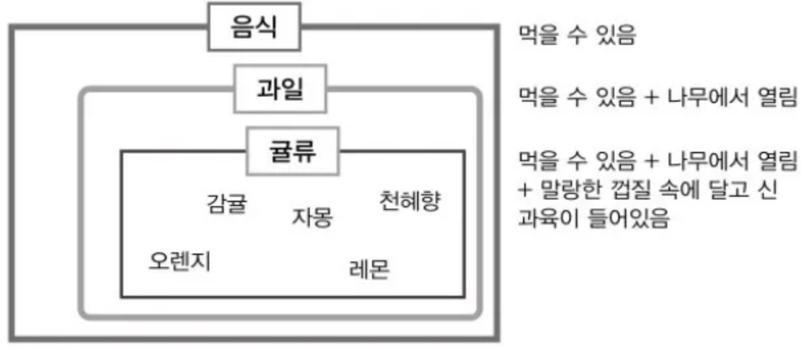
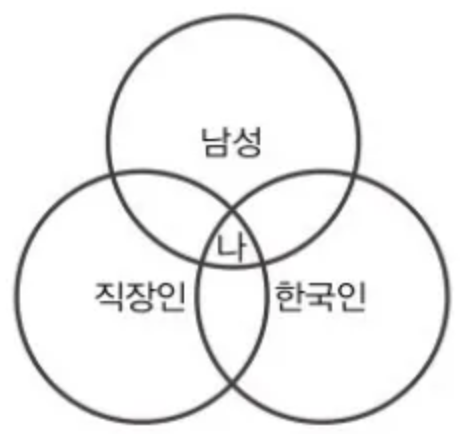
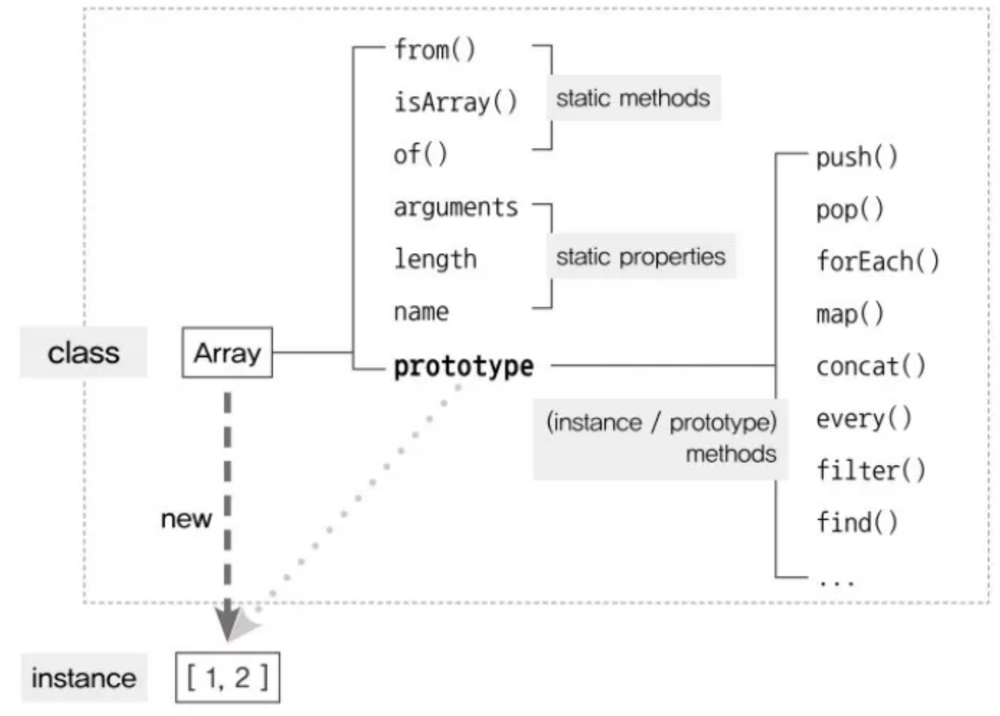
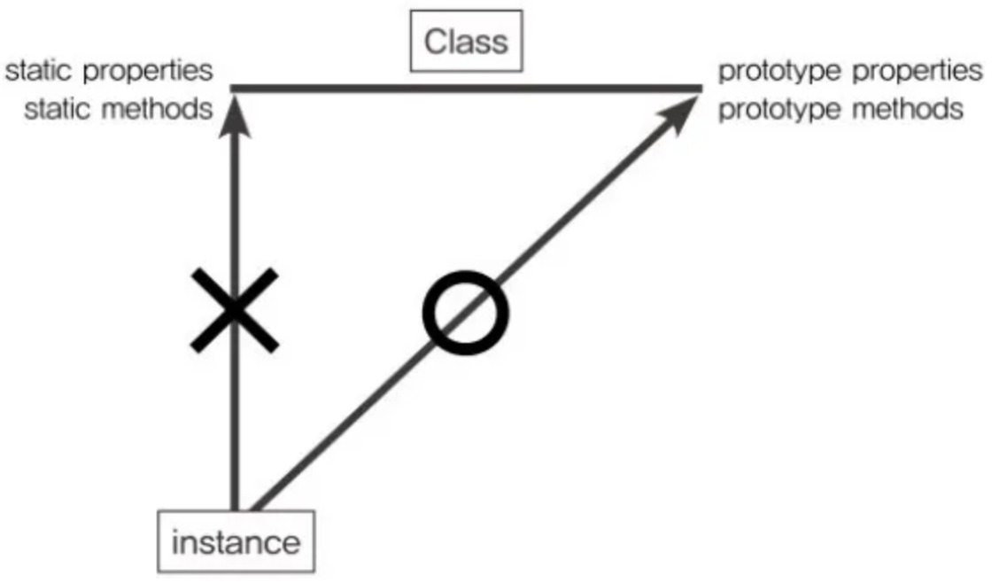
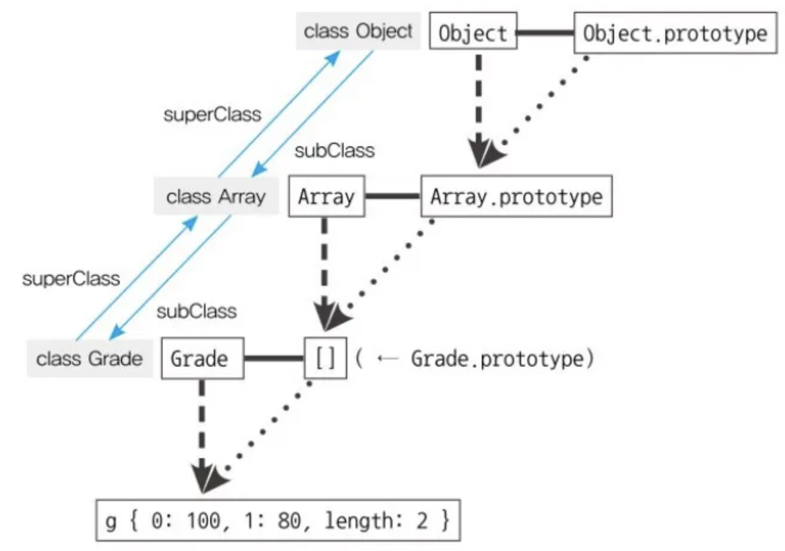
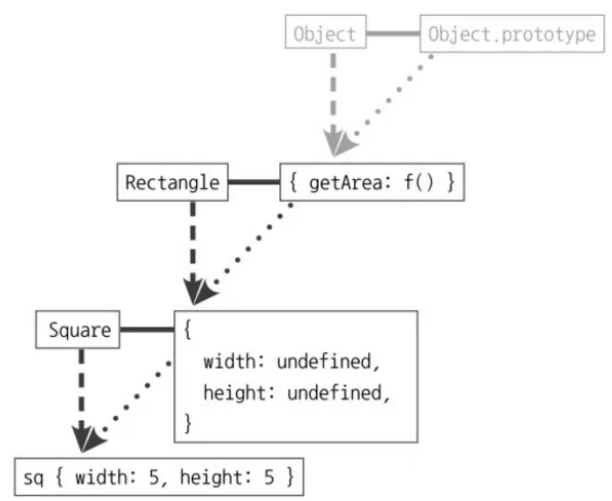
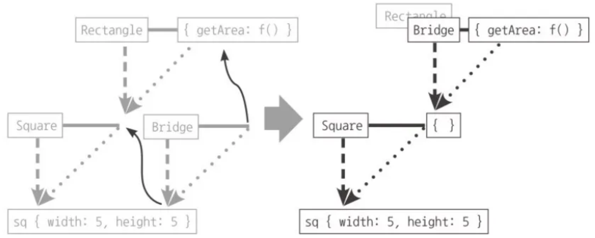

## 1. 클래스와 인스턴스의 개념 이해

객체지향 프로그래밍에서 거의 반드시 등장하는 클래스라는 단어의 의미는 일반적으로 쓰이는 의미(계급, 집단, 집합)와 거의 흡사하다.

일반적인 개념으로 살펴보았을 때, `음식`이라는 범주 안에는 `고기`, `채소`, `과일` 등등 다양한 것들이 들어갈 수 있다. 

그리고 `과일` 범주 아래에는 `배`, `사과`, `바나나`, `감`, `오렌지` 등이 포함된다.

여기서 `배`, `사과`, `바나나` 등은 직접 만질 수도 볼 수도 있는 구체적이고 실존하는 사물에 해당한다. 

반면, `음식`이나 `과일`은 어떤 사물들의 공통 속성을 모아 정의한 것일 뿐 만질 수도 볼 수도 없는 추상적 개념이다.

`음식`은 과일과의 관계에서 상위 개념이고, `과일`은 음식과의 관계에서 하위의 개념이다. 이를 그림으로 표현하면 아래와 같다.



위 그림에서와 같이 음식, 과일은 모두 집단, 즉 클래스이다. 

음식은 과일보다 상위 클래스(superclass), 과일은 음식보다 하위 클래스(subclass)이다.

이때 과일 분류 하위에 또 다른 분류가 있을 경우에는 클래스 간 관계는 어떻게 될까?



음식은 과일의 `superclass`, 과일은 음식의 `subclass`이면서 귤류의 `superclass`, 귤류는 과일의 `subclass`이다. 

클래스는 하위로 갈수록 상위 클래스의 속성을 상속하면서 더 구체적인 요건이 추가 또는 변경된다. 

물론 하위 클래스가 아무리 구체화 되더라도 이들은 결국 추상적인 개념일 뿐이다.

한편 감귤, 자몽, 천혜향 등은 앞의 클래스들의 속성을 지니는, 실제로 먹을 수 있고 만질 수 있는 실존하는 개체이다.

이처럼 **어떤 클래스의 속성을 지니는 실존하는 개체를 일컬어 `인스턴스(instance)`** 라고 한다.

현실 세계에서는 개체들이 이미 존재하는 상태에서 이들을 구분짓기 위해 클래스를 도입한다. 이 때문에 하나의 개체가 같은 레벨에 있는 서로 다른 여러 클래스의 인스턴스일 수 있다.



반면 프로그래밍 언어상에서는 접근 방식이 정반대이다.

사용자가 직접 여러 가지 클래스를 정의해야 하며, 클래스를 바탕으로 인스턴스를 만들 때 비로소 어떤 개체가 클래스의 속성을 지니게 된다. 

또한 **한 인스턴스는 하나의 클래스만을 바탕으로 만들어진다.** 

어떤 인스턴스가 다양한 클래스에 속할 수는 있지만 이 클래스들은 모두 인스턴스 입장에서는 **직계존속**이다.

프로그래밍 언어에서의 클래스는 현실세계의 클래스와 마찬가지로 '공통 요소를 지니는 집단을 분류하기 위한 개념' 이라는 측면에서는 일치하지만, 클래스가 먼저 정의돼야만 그로부터 공통적인 요소를 지니는 개체들을 생성할 수 있다는 차이가 있다.

프로그래밍 언어에서의 클래스는 사용하기에 따라 추상적인 대상일 수도 있고 구체적인 개체가 될 수도 있다.

## 2. 자바스크립트의 클래스

자바스크립트는 프로토타입 기반 언어이므로 클래스의 개념이 존재하지 않지만, 프로토타입을 일반적인 의미에서의 클래스 관점에서 접근해보면 비슷하게 해석할 수 있는 요소도 있다.



생성자 함수 `Array`를 `new` 연산자와 함께 호출하면 인스턴스가 생성된다. 

이때 `Array`를 일종의 클래스라고 하면, `Array`의 `prototype` 객체 내부 요소들이 인스턴스에 '상속' 된다고 볼 수 있다.

인스턴스에 상속되는지(인스턴스가 참조하는지) 여부에 따라 스태틱 멤버와 인스턴스 멤버로 나뉜다.

이때 '인스턴스 메서드'라는 명칭은 프로토타입에 정의한 메서드를 지칭하는 것인지 인스턴스에 정의한 메서드를 지칭하는 것인지에 대체 혼란을 야기하기 때문에, 자바스크립트의 특징을 살려 `프로토타입 메서드` 라고 부르는 것이 좋다.

- 예제 7-1. 스태틱 메서드, 프로토타입 메서드
    
    ```jsx
    var Rectangle = function(width, height) {
      this.width = width;
      this.height = height;
    };
    Rectangle.prototype.getArea = function() {
    	return this.width * this.height;
    };
    Rectangle.isRectangle = function(instance) {
      return (
        instance instanceof Rectangle && instance.width > 0 && instance.height > 0
    	);
    };
    
    var rect1 = new Rectangle(3, 4);
    console.log(rect1.getArea()); // 12 (O)
    console.log(rect1.isRectangle(rect1)); // Error (X)
    console.log(Rectangle.isRectangle(rect1)); // true
    ```
    
    - 전형적인 생성자 함수와 인스턴스이다.
    - 12번째 줄에서 `Rectangle` 함수를 `new` 연산자와 함께 호출해서 생성된 인스턴스를 `rect1`에 할당했다.
    - 13번째 줄에서 호출한 `getArea`는 실제로는 `rect1.__proto__.getArea`에 접근하는데, 이때 `__proto__`를 생략했으므로 결과로 `rect1.width * rect1.height`의 계산값이 반환될 것이다.
    - 이처럼 **인스턴스에서 직접 호출할 수 있는 메서드가 바로 프로토타입 메서드**이다.
    - 한편 14번째 줄은 `rect1` 인스턴스에서 `isRectangle`이라는 메서드에 접근하고자 한다. 하지만 `isRectangle` 메서드는 해당 인스턴스에서 직접 접근할 수 없으므로 `undefined`를 실행하라는 명령이 된다. 결과적으로 함수가 아니기 때문에 실행할 수 없다는 의미의 "Uncaught TypeError : not a function" 에러가 발생한다.

이렇게 **인스턴스에서 직접 접근할 수 없는 메서드를 스태틱 메서드**라고 한다. 

스태틱 메서드는 15번째 줄처럼 생성자 함수를 this로 해야만 호출할 수 있다.



구체적인 인스턴스가 사용할 메서드를 정의한 '틀'의 역할을 담당하는 목적을 가질 때의 클래스는 추상적인 개념이지만, 클래스 자체를 this로 해서 직접 접근해야 되는 스태틱 메서드를 호출할 때의 클래스는 그 자체가 하나의 개체로서 취급된다.

## 3. 클래스 상속

### 7-3-1 기본 구현

이번 절에서는 프로토타입 체인을 활용해 클래스 상속을 구현하고 최대한 전통적인 객체지향 언어에서의 클래스와 비슷한 형태로까지 발전 시켜보는 것을 목표로 한다.

이전 장에서 다룬 내용인 아래의 예제(다중 프로토타입 체인)가 클래스 상속의 핵심이다.

- 예제 7-2. 6-2-4절의 Grade 생성자 함수 및 인스턴스
    
    ```jsx
    var Grade = function () {
      var args = Array.prototype.slice.call(arguments);
      for (var i = 0; i < args.length; i++) {
        this[i] = args[i];
      }
      this.length = args.length;
    };
    Grade.prototype = [];
    var g = new Grade(100, 80);
    
    ```
    



자바스크립트에서 클래스 상속을 구현했다는 것은 결국 프로토타입 체이닝을 잘 연결한 것으로 이해하면 된다.

기본적으로는 그러하지만, 세부적으로 완벽하게 `superclass`와 `subclass`의 구현이 이루어진 것은 아니다.

예제 7-2에는 `length` 프로퍼티가 삭제 가능하다는 점과, `Grade.prototype`에 빈 배열을 참조 시켰다는 문제가 있다.

- 예제 7-3. length 프로퍼티를 삭제한 경우
    
    ```jsx
    ...
    g.push(90);
    console.log(g); // Grade { 0: 100, 1: 80, 2: 90, length: 3 }
    
    delete g.length;
    g.push(70);
    console.log(g); // Grade { 0: 70, 1: 80, 2: 90, length: 1 }
    
    ```
    
    - 11번째 줄에서는 원하는 대로 결과가 잘 나온다.
    - 하지만 12번째 줄에서 `length` 프로퍼티를 삭제한 후 다시 `push`를 했더니 `push`한 값이 0번째 인덱스에 들어갔고, `length`가 1이 되었다.

내장 객체인 배열 인스턴스의 `length` 프로퍼티는 삭제가 불가능하지만 `Grade` 클래스의 인스턴스는 배열 메서드를 상속하지만 **기본적으로 일반 객체의 성질을 지니므로** 삭제가 가능해서 생긴 문제이다.

한편 `push`를 했을 때 0번째 인덱스에 70이 들어가고 `length`가 다시 1이 될 수 있었던 까닭은 `g.__proto__`, 즉 `Grade.prototype`이 빈 배열을 가리키고 있기 때문이다.

자바스크립트 엔진이 `g.length`를 읽고자 하는데 `g.length`가 없어 프로토타입 체이닝을 타고 `g.__proto__.length`를 읽어온 것이다.

- 예제 7-4. 요소가 있는 배열을 prototype에 매칭한 경우
    
    ```jsx
    ...
    Grade.prototype = ['a', 'b', 'c', 'd'];
    var g = new Grade(100, 80);
    
    g.push(90);
    console.log(g); // Grade { 0: 100, 1: 80, 2: 90, length: 3 }
    
    delete g.length;
    g.push(70);
    console.log(g); // Grade { 0: 100, 1: 80, 2: 90, ___ 4: 70, length: 5 }
    
    ```
    
    - 이번에는 `prototype`에 `length`가 4인 배열을 할당해보았다.
    - 14번째 줄에서 예제 7-3과는 다르게 동작하는 것을 확인할 수 있다.
    - 이는 `g.length`가 없으니 `g.__proto__.length`를 찾고, 값이 4이므로 인덱스 4에 70을 넣고, 다시 `g.length`에 5를 부여하는 순서로 동작한 것이다.

이처럼 클래스에 있는 값이 인스턴스의 동작에 영향을 줘서는 안된다.

클래스의 추상성을 해치지 않도록 **인스턴스와의 관계에서는 구체적인 데이터를 지니지 않고 오직 인스턴스가 사용할 메서드만을 지니는 '틀'로서만 작용하게끔 작성해야 된다**.

이번에는 사용자가 정의한 두 클래스 사이에서의 상속 관계를 구현해보도록 한다.

- 예제 7-5. Rectangle, Square 클래스
    
    ```jsx
    // 직사각형 클래스와 정사각형 클래스
    
    var Rectangle = function (width, height) {
      this.width = width;
      this.height = height;
    };
    Rectangle.prototype.getArea = function () {
      return this.width * this.height;
    };
    var rect = new Rectangle(3, 4);
    console.log(rect.getArea()); // 12
    
    var Square = function (width) {
      this.width = width;
    };
    Square.prototype.getArea = function () {
      return this.width * this.width;
    };
    var sq = new Square(5);
    console.log(sq.getArea()); // 25
    
    ```
    
    - `Rectangle`과 `Square` 클래스에 공통 요소가 보인다.
    - 만약 `Square`에서 `width` 프로퍼티만 쓰지 않고 `height` 프로퍼티에 `width` 값을 부여하는 형태가 된다면 `getArea`도 동일하게 고칠 수 있다.
- 예제 7-6. Square 클래스 변형
    
    ```
    ...
    var Square = function(width) {
      this.width = width;
      this.height = width;
    };
    Square.prototype.getArea = function() {
      return this.width * this.height;
    };
    ...
    
    ```
    
    - 정사각형은 직사각형에 '네 변의 길이가 모두 같다'라는 구체적인 조건이 하나 추가된 개념이다.
    - 위의 예제처럼 고치면 소스상으로도 `Square`를 `Rectangle`의 하위 클래스로 삼을 수 있다.
    - `getArea`라는 메서드는 동일한 동작을 하므로 상위 클래스에서만 정의하고, 하위 클래스에서는 해당 메서드를 상속하면서 `height` 대신 `width`를 넣어주면 된다.
- 예제 7-7. Rectangle을 상속하는 Square 클래스
    
    ```jsx
    ...
    10 var Square = function(width) {
    11  Rectangle.call(this, width, width);
    12 };
    13 Square.prototype = new Rectangle();
    ...
    
    ```
    
    - Square의 생성자 함수 내부에서 Rectangle의 생성자 함수를 함수로써 호출했다.
    - 이때 인자 height 자리에 width를 전달했다.
    - 13번째 줄에서는 메서드를 상속하기 위해 Square의 프로토타입 객체에 Rectangle의 인스턴스를 부여했다.

이것만으로도 일단 원하는 대로 동작하지만, 완벽한 클래스 체계가 구축됐다고 볼 수는 없다. 

여전히 **클래스에 있는 값이 인스턴스에 영향을 줄 수 있는 구조라는 문제를 가지고 있을 것**이다.


- `Square`의 인스턴스임을 표시하고 있음
- `width`와 `height`에 모두 5가 들어있음
- `__proto__`는 `Rectangle`의 인스턴스임을 표시하고 있음
- 바로 이어 **`width`, `height`에 모두 undefined가 할당 돼있음을 확인 가능**



이는 Square.prototype에 값이 존재하는 것이 문제인데, 이때 임의로 `Square.prototype.width`에 값을 부여하고 `sq.width`의 값을 지워버린다면 프로토타입 체이닝에 의해 엉뚱한 결과가 나오게 될 것이다.

나아가 `constructor`가 여전히 `Rectangle`을 바라보고 있다는 문제도 있다.

```jsx
var rect2 = new sq.constructor(2, 3);
console.log(rect2); // Rectangle { width : 2, height : 3 }
```

이처럼 하위 클래스로 삼을 생성자 함수의 prototype에 상위 인스턴스를 부여하는 것만으로도 기본적인 메서드 상속은 가능하지만, 다양한 문제가 발생할 여지가 있어 구조적으로 안정성이 떨어진다.

### 7-3-2. 클래스가 구체적인 데이터를 지니지 않게 하는 방법

클래스가 구체적인 데이터를 지니지 않게 하는 방법은 여러 가지가 있는데, 그 중 가장 쉬운 방법은 일단 만들고 나서 프로퍼티들을 일일이 지우고 더는 새로운 프로퍼티를 추가할 수 없게 하는 것이다.

- 예제 7-8. 클래스 상속 및 추상화 방법(1) - 인스턴스 생성 후 프로퍼티 제거
    
    ```jsx
    var extendClass1 = function (SuperClass, SubClass, subMethods) {
      SubClass.prototype = new SuperClass();
      for (var prop in SubClass.prototype) {
        if (SubClass.prototype.hasOwnProperty(prop)) {
          delete SubClass.prototype[prop];
        }
      }
      if (subMethods) {
        for (var method in subMethods) {
          SubClass.prototype[method] = subMethods[method];
        }
      }
      Object.freeze(SubClass.prototype);
      return SubClass;
    };
    
    var Rectangle = function (width, height) {
      this.width = width;
      this.height = height;
    };
    Rectangle.prototype.getArea = function () {
      return this.width * this.height;
    };
    var Square = extendClass1(Rectangle, function (width) {
      Rectangle.call(this, width, width);
    });
    var sq = new Square(5);
    console.log(sq.getArea()); // 25
    
    ```
    
    - 예제의 `extendClass1` 함수는 `SuperClass`와 `SubClass`, `SubClass`에 추가할 메서드들이 정의된 객체를 받아서 `SubClass`의 prototype 내용을 정리하고 freeze하는 내용으로 구성돼있다.
    - 로직이 다소 복잡해졌지만 범용성 측면에서 좋은 방법이다.

두 번째 방법으로 더글라스 크락포드가 제시하여 대중적으로 널리 알려진 방법으로,

```jsx
01 var Rectangle = function(width, height) {
02   this.width = width;
03   this.height = height;
04 };

05 Rectangle.prototype.getArea = function () {
06   return this.width * this.height;
07 };

08 var Square = function (width) {
09   Rectangle.call(this, width, width);
10 };

11 var Bridge = function () {};
12 Bridge.prototype = Rectangle.prototype;
13 Square.prototype = new Bridge();
14 Object.freeze(Square.prototype);

```



`SubClass`의 prototype에 직접 `SuperClass`의 인스턴스를 할당하는 대신,

- 아무런 프로퍼티를 생성하지 않는 빈 생성자 함수(`Bridge`)를 하나 더 만들어,
- 그 prototype이 `SuperClass`의 prototype을 바라보게 한 다음,
- `SubClass`의 prototype에는 `Bridge`의 인스턴스를 할당하게 하는 것이다.

빈 함수에 다리 역할을 부여하는 것이다.

이로써 인스턴스를 제외한 프로토타입 체인 경로상에는 더는 구체적인 데이터가 남아있지 않게 된다. 

범용성을 고려하면 다음처럼 작성할 수 있다.

- 예제 7-9. 클래스 상속 및 추상화 방법(2) - 빈 함수를 활용
    
    ```jsx
    var extendClass2 = (function () {
      var Bridge = function () {};
      return function (SuperClass, SubClass, subMethods) {
        Bridge.prototype = SuperClass.prototype;
        SubClass.prototype = new Bridge();
        if (subMethods) {
          for (var method in subMethods) {
            SubClass.prototype[method] = subMethods[method];
          }
        }
        Object.freeze(SubClass.prototype);
        return SubClass;
      };
    })();
    
    var Rectangle = function (width, height) {
      this.width = width;
      this.height = height;
    };
    Rectangle.prototype.getArea = function () {
      return this.width * this.height;
    };
    var Square = extendClass2(Rectangle, function (width) {
      Rectangle.call(this, width, width);
    });
    var sq = new Square(5);
    console.log(sq.getArea()); // 25
    
    ```
    
    - 위의 예제에서는 즉시실행함수 내부에서 `Bridge`를 선언하여 이를 클로저로 활용함으로써 메모리에 불필요한 함수 선언을 줄였다.
    - `subMethods`에는 `SuperClass`의 prototype에 담길 메서드들을 객체로 전달하게끔 했다.

마지막으로 Object.create를 이용한 방법이 있다.

- 예제 7-10. 클래스 상속 및 추상화 방법(3) - Object.create 활용
    
    ```jsx
    var Rectangle = function (width, height) {
      this.width = width;
      this.height = height;
    };
    Rectangle.prototype.getArea = function () {
      return this.width * this.height;
    };
    var Square = function (width) {
      Rectangle.call(this, width, width);
    };
    Square.prototype = Object.create(Rectangle.prototype);
    Object.freeze(Square.prototype);
    
    var sq = new Square(5);
    console.log(sq.getArea()); // 25
    
    ```
    
    - 이 방법은 **`SubClass`의 prototype의 `__proto__`가 `SuperClass`의 prototype을 바라보되, `SuperClass`의 인스턴스가 되지는 않으므로 앞서 소개한 두 방법보다 간단하면서 안전하다.**

### 7-3-3 constructor 복구하기

기본적인 상속에는 성공했지만 `SubClass` 인스턴스의 constructor는 여전히 `SuperClass`를 가리키는 상태이다.

엄밀히는 `SubClass` 인스턴스에는 constructor가 없고, `SubClass.prototype`에도 없는 상태이다. 

따라서 위 코드들의 `SubClass.prototype.constructor`가 원래의 `SubClass`를 바라보도록 해주면 된다.

- 예제 7-11. 클래스 상속 및 추상화 방법 - 완성본(1) - 인스턴스 생성 후 프로퍼티 제거
    
    ```jsx
    var Rectangle = function (width, height) {
      this.width = width;
      this.height = height;
    };
    Rectangle.prototype.getArea = function () {
      return this.width * this.height;
    };
    var Square = function (width) {
      Rectangle.call(this, width, width);
    };
    Square.prototype = Object.create(Rectangle.prototype);
    Object.freeze(Square.prototype);
    
    var sq = new Square(5);
    console.log(sq.getArea()); // 25
    
    ```
    
- 예제 7-12 클래스 상속 및 추상화 방법 - 완성본(2) - 빈 함수를 활용
    
    ```jsx
    var extendClass2 = (function () {
      var Bridge = function () {};
      return function (SuperClass, SubClass, subMethods) {
        Bridge.prototype = SuperClass.prototype;
        SubClass.prototype = new Bridge();
        SubClass.prototype.consturctor = SubClass;
        Bridge.prototype.constructor = SuperClass;
        if (subMethods) {
          for (var method in subMethods) {
            SubClass.prototype[method] = subMethods[method];
          }
        }
        Object.freeze(SubClass.prototype);
        return SubClass;
      };
    })();
    
    ```
    
- 예제 7-13. 클래스 상속 및 추상화 방법 - 완성본(3) - Object.create 활용
    
    ```
    var extendClass3 = function (SuperClass, SubClass, subMethods) {
      SubClass.prototype = Object.create(SuperClass.prototype);
      SubClass.prototype.constructor = SubClass;
      if (subMethods) {
        for (var method in subMethods) {
          SubClass.prototype[method] = subMethods[method];
        }
      }
      Object.freeze(SubClass.prototype);
      return SubClass;
    };
    
    ```
    

### 7-3-4. 상위 클래스에의 접근 수단 제공

때론 하위 클래스의 메서드에서 상위 클래스의 메서드 실행 결과를 바탕으로 추가적인 작업을 수행하고 싶을 때가 있다.

하위 클래스에서 상위 클래스의 프로토타입 메서드에 접근하기 위해, 다른 객체지향 언어들의 클래스 문법 중 하나인 `super`를 흉내 내보고자 한다.

- 예제 7-14. 상위 클래스 접근 수단인 super 메서드 추가
    
    ```jsx
    01 var extendClass = function(SuperClass, SubClass, subMethods) {
    02   SubClass.prototype = Object.create(SuperClass.prototype);
    03   SubClass.prototype.constructor = SubClass;
    04   SubClass.prototype.super = function(propName) {
        // 추가된 부분 시작
    05     var self = this;
    06     if (!propName) return function() {
    07         SuperClass.apply(self, arguments);
    08       };
    09     var prop = SuperClass.prototype[propName];
    10     if (typeof prop !== 'function') return prop;
    11     return function() {
    12       return prop.apply(self, arguments);
    13     };
    14   }; // 추가된 부분 끝
    15   if (subMethods) {
    16     for (var method in subMethods) {
    17       SubClass.prototype[method] = subMethods[method];
    18     }
    19   }
    20   Object.freeze(SubClass.prototype);
    21   return SubClass;
    22 };
    
    23 var Rectangle = function(width, height) {
    24   this.width = width;
    25   this.height = height;
    26 };
    27 Rectangle.prototype.getArea = function() {
    28   return this.width * this.height;
    29 };
    30 var Square = extendClass(
    31   Rectangle,
    32   function(width) {
    33     this.super()(width, width); // super 사용 (1)
    34   },
        {
    35     getArea: function() {
    36       console.log('size is :', this.super('getArea')()); // super 사용 (2)
    37     },
    38   }
    39 );
    40 var sq = new Square(10);
    41 sq.getArea(); // size is : 100
    42 console.log(sq.super('getArea')()); // 100
    
    ```
    
    - **4~14번째 줄**까지가 새로 추가된 내용으로, `super` 메서드를 정의.
    - **6번째 줄** : 인자가 비어있을 경우에 `SuperClass` 생성자 함수에 접근하는 것으로 간주
    - **10번째 줄** : `SuperClass`의 prototype 내부의 `propName`에 해당하는 값이 함수가 아닌 경우에는 해당 값을 그대로 반환
    - **11번째 줄** : 함수인 경우이므로 마찬가지로 클로저를 활용해 메서드에 접근하는 것으로 여기도록 함

해당 `super` 메서드의 사용법은 다음과 같다.

`SuperClass`의 생성자 함수에 접근하고자 할 때는 `this.super()`, `SuperClass`의 프로토타입 메서드에 접근하고자 할 때는 `this.super(propName)`와 같이 사용하면 된다.

33번째 줄을 보면 기존에는 `SuperClass.call(this, width, width)`처럼 직접 this를 바인딩하는 문법을 썼다면 이제는 `this.super()(width, width)`라고 함으로써 가독성이 더 좋아졌다.

## 4. ES6의 클래스 및 클래스 상속

ES5 체계에서의 생성자 함수 및 프로토타입과 ES6의 클래스 문법을 비교해보자.

- 예제 7-15. ES5와 ES6의 클래스 문법 비교
    
    ```jsx
    01 var ES5 = function(name) {
    02   this.name = name;
    03 };
    04 ES5.staticMethod = function() {
    05   return this.name + ' staticMethod';
    06 };
    07 ES5.prototype.method = function() {
    08   return this.name + ' method';
    09 };
    10 var es5Instance = new ES5('es5');
    11 console.log(ES5.staticMethod()); // es5 staticMethod
    12 console.log(es5Instance.method()); // es5 method
    
    13 var ES6 = class {
    14   constructor(name) {
    15     this.name = name;
    16   }
    17   static staticMethod() {
    18     return this.name + ' staticMethod';
    19   }
    20   method() {
    21     return this.name + ' method';
    22   }
    23 };
    24 var es6Instance = new ES6('es6');
    25 console.log(ES6.staticMethod()); // es6 staticMethod
    26 console.log(es6Instance.method()); // es6 method
    
    ```
    
    - **13번째 줄** : `class` 라는 명령어 뒤에 바로 `{}`가 등장. 이 괄호 묶음 내부가 클래스 본문 영역이다.
    - **14번째 줄** : `constructor`라는 이름 뒤에 바로 `() {` 가 등장. 클래스 본문에서는 'function' 키워드를 생략하더라도 모두 메서드로 인식한다. 이 부분은 ES5의 생성자 함수와 동일한 역할을 수행한다.
    - **16번째 줄** : 메서드와 다음 메서드 사이에는 콤마(,)로 구분하지 않는다.
    - **17번째 줄** : `static`이라는 키워드 뒤에 `staticMethod` 라는 이름이 등장. `static` 키워드는 해당 메서드가 `static` 메서드임을 알리는 내용.
    - **20번째 줄** : `method`라는 이름이 등장. 이는 자동으로 `prototype` 객체 내부에 할당되는 메서드. `ES5.prototype.method`와 동일하게, 인스턴스가 프로토타입 체이닝을 통해 마치 자신의 것처럼 호출할 수 있는 메서드이다.

다음으로는 클래스 상속에 대해 알아보자.

- 예제 7-16. ES6의 클래스 상속
    
    ```jsx
    var Rectangle = class {
      constructor(width, height) {
        this.width = width;
        this.height = height;
      }
      getArea() {
        return this.width * this.height;
      }
    };
    var Square = class extends Rectangle {
      constructor(width) {
        super(width, width);
      }
      getArea() {
        console.log("size is :", super.getArea());
      }
    };
    
    ```
    
    - **10번째 줄** : `Square`를 `Rectangle` 클래스를 상속받는 `SubClass`로 만들기 위해 `class` 명령어 뒤에 단순히 'extends Rectangle' 이라는 내용을 추가.
    - **12번째 줄** : `constructor` 내부에는 `super`라는 키워드를 함수처럼 사용할 수 있는데, 이 함수는 `SuperClass`의 `constructor`를 실행한다.
    - **15번째 줄** : `constructor` 메서드를 제외한 다른 메서드에서는 `super` 키워드를 마치 객체처럼 사용할 수 있고, 이때 객체는 `SuperClass.prototype`을 바라보는데, 호출한 메서드의 this는 'super'가 아닌 원래의 this를 그대로 따른다.

## 5.d 정리

### 클래스 주요 키워드

- **클래스** : 어떤 사물의 공통 속성을 모아 정의한 추상적인 개념
- **인스턴스** : 클래스의 속성을 지니는 구체적인 사례
- **하위 클래스** : 상위 클래스의 조건을 충족하면서 더욱 구체적인 조건이 추가된 것
- **프로토타입 메서드** : 클래스의 prototype 내부에 정의된 메서드. 인스턴스가 마치 자신의 것처럼 호출 가능
- **스태틱 메서드** : 클래스(생성자 함수)에 직접 정의한 메서드. 인스턴스가 직접 호출할 수 없고, 클래스(생성자 함수)에 의해서만 호출할 수 있음.

### 클래스 상속을 흉내 내기 위한 세 가지 방법

- `SubClass.prototype`에 `SuperClass`의 인스턴스를 할당한 다음 프로퍼티를 모두 삭제하는 방법
- 빈 함수(Bridge)를 활용하는 방법
- `Object.create`를 이용하는 방법

이 세 방법 모두 constructor 프로퍼티가 원래의 생성자 함수를 바라보도록 조정해야 됨.