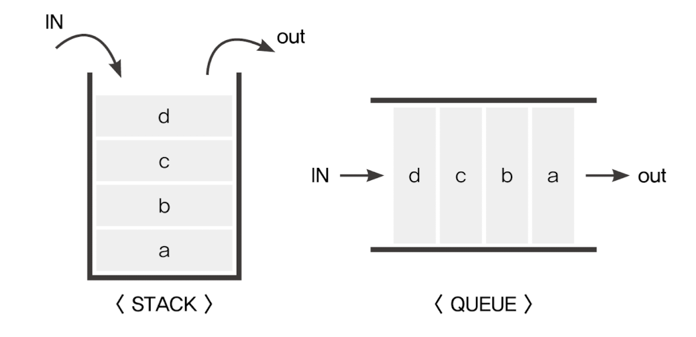
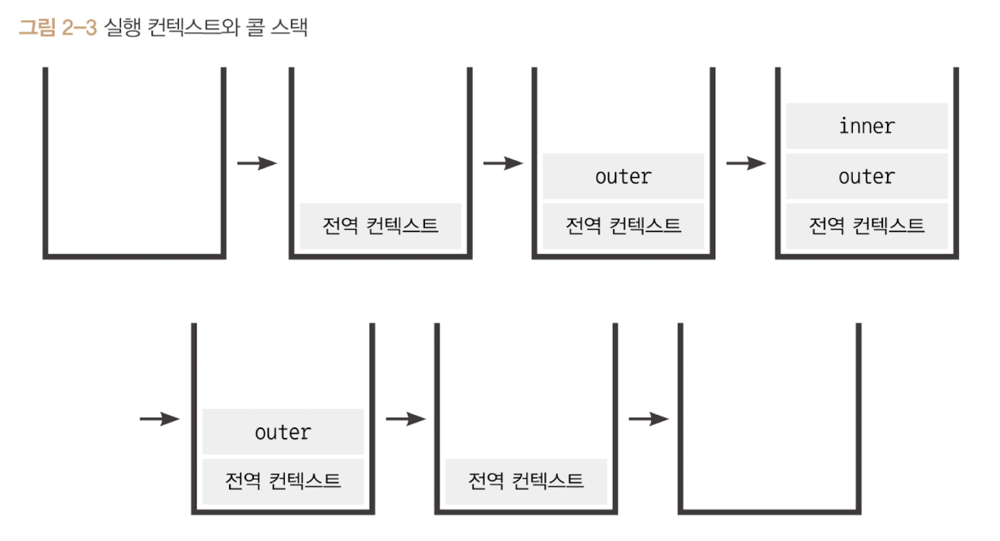
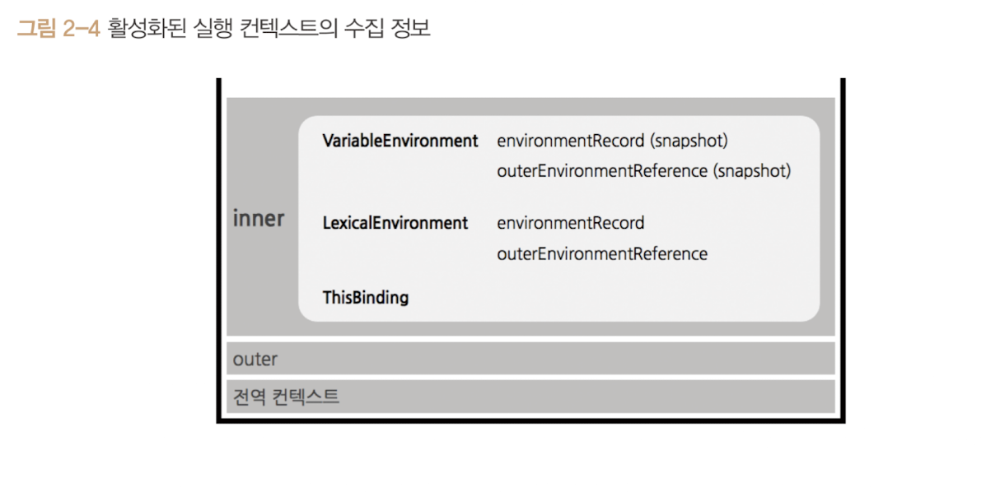

# Chapter2. 실행 컨텍스트

## 1️⃣ 실행 컨텍스트

- 💬 **스택(Stack)과 큐(Queue)**
  
  - **스택(Stack)**
    - 출입구가 1개, 데이터가 아래부터 쌓이는 구조
    - 빈 스택에 데이터를 a → b → c → d 순서로 저장했다면, 꺼낼 때는 d → c → b → a 순서로 꺼내야 함. _(후입선출)_
  - **큐(Queue)**
    - 출입구 2개, 보통 한쪽은 입력, 한쪽은 출력만을 담당하는 구조
    - 빈 큐에 데이터를 a → b → c → d 순서로 저장했다면, 꺼낼 때도 a → b → c → d 순서로 꺼냄. _(선입선출)_
- **📝 실행 컨텍스트란?**
  - 실행할 코드의 **조건과 환경 정보를 모아놓은 객체**
  - 실행 컨텍스트가 활성화되면 다음과 같은 과정이 발생:
    1. **변수 호이스팅** (변수 및 함수 선언 정보를 미리 수집)
    2. **환경 정보 설정** (현재 실행 환경 관련 정보 저장)
    3. **this 바인딩** (this가 어떤 객체를 가리키는지 결정)
  - 실행 컨텍스트는 **콜 스택(FILO 방식)** 에 쌓이며, 가장 위의 컨텍스트가 먼저 실행됨.
  - 실행 컨텍스트 구성방법
    - 전역공간, eval()함수, 함수, 블록({})(←ES6) 등 이 있음.
      일반적인 구성은 함수를 실행하는 방법 뿐임.
- **🔄 실행 컨텍스트 동작 과정 (콜 스택 흐름)**
  ### ✅ 실행 컨텍스트 콜 스택 순서
  1. 자바스크립트 실행 시, **전역 실행 컨텍스트**가 콜 스택에 쌓임.
  2. 함수 호출 시, 해당 함수의 **실행 컨텍스트**가 콜 스택에 추가됨.
  3. 함수 내부 코드 실행 후, **컨텍스트가 제거됨.**
  4. 모든 코드 실행이 끝나면, **전역 실행 컨텍스트도 제거됨.**
  🔹 **예제 코드**
  ```jsx
  var a = 1;
  function outer() {
    function inner() {
      console.log(a);
      var a = 3;
    }
    inner();
    console.log(a);
  }
  outer();
  console.log(a);
  ```
  🔹 **콜 스택 동작 순서**
  
  1. `outer()` 호출 → `outer 실행 컨텍스트`가 스택에 추가됨.
  2. `inner()` 호출 → `inner 실행 컨텍스트`가 스택에 추가됨.
  3. `inner()` 실행 완료 → 스택에서 제거됨.
  4. `outer()` 실행 완료 → 스택에서 제거됨.
  5. 전역 코드 실행 완료 → 전역 실행 컨텍스트 제거.
- **🔍 실행 컨텍스트 내부 구성**
  
  - `VariableEnvironment` : 선언된 변수 정보와 외부 환경 참조 정보를 저장 (초기 스냅샷)
  - `LexicalEnvironment` : VariableEnvironment와 동일한 정보지만, 실시간으로 변경 사항 반영
  - `ThisBinding` : 실행컨텍스트에서 `this`가 가리키는 객체

---

## 2️⃣ VariableEnvironment **(변수 환경)**

- 실행 컨텍스트 내부에서 변수와 함수 선언 정보를 저장하는 객체.
- 선언된 변수와 함수가 **초기화된 상태(스냅샷)** 로 저장됨.
- 이후 코드 실행 중 변수가 변경되더라도 `VariableEnvironment` 는 변경되지 않음.
- 실행 컨텍스트를 생성시 `VariableEnvironment` 에 정보를 먼저 담은 다음
  → 이를 그대로 복사해서 `LexicalEnvironment` 를 만들고, 이 후에는 `LexicalEnvironment` 를 주로 활용함.
- `VariableEnvironment` 의 내부는 `environmaintRecord`와 `outer-EnvironmentReference`로 구성되어있음.

---

## 3️⃣ LexicalEnvironment (어휘적 환경)

- 실행 컨텍스트의 구성 요소 중 하나로, 코드 실행 시점에 변수 및 함수 선언 정보를 저장하는 객체.
- **📌 Environment Record와 호이스팅**
  ### 🔹 Environment Record의 역할
  👉  `Environment Record`는 현재 컨텍스트와 관련된 식별자 정보를 저장하는 객체임.
  주요 정보 :
  1. **함수에 지정된 매개변수 식별자**
  2. **선언된 함수의 정보**
  3. **var로 선언된 변수 식별자**
  ### 🔹 호이스팅(Hoisting)
  👉 자바스크립트 엔진은 코드를 실행하기 전에 `Environment Record` 정보를 수집한다.
  실행 전에 이미 모든 식별자 정보를 알고 있는 상태가 됨.
  - 실행 컨텍스트 내 모든 식별자가 **위로 끌어올려진 것처럼** 동작하지만, 실제 메모리에서 이동하는 것은 X
  - 따라서 아래쪽에 선언된 함수 및 변수도 실행 시점에서 참조 가능함.
  ### ✅ 예제 1: Hoisting
  ```jsx
  function a() {
    console.log(func()); // 1000
    function func() {
      return 1000;
    }
    var x = 1;
    console.log(x); // 1
    var x;
    console.log(x); // 1
    var x = 2;
    console.log(x); // 2
  }
  a();
  ```
  ### 📌 실행 순서
  1. `func` 함수 선언
  2. `func()` 실행 후 결과(1000) 출력
  3. `var x` 선언 (중복 선언은 무시됨)
  4. `x = 1` 할당 및 출력
  5. `x = 2` 재할당 및 출력
  이처럼 변수가 선언만 되고 값이 할당되지 않은 경우 `undefined`가 될 것 같지만, 이미 선언된 변수는 무시되므로 1 → 1 → 2가 출력된다.
- **📌 함수 선언문과 함수 표현식**
  ### 🔹 함수 선언문 (Function Declaration)
  ```jsx
  function myFunc() {
    return "Hello";
  }
  ```
  - `function` 키워드로 선언되며, **호이스팅의 영향을 받아** 코드 실행 전에 미리 메모리에 등록된다.
  - 따라서 선언 전에 호출해도 동작한다.
  ### 🔹 함수 표현식 (Function Expression)
  ```jsx
  const myFunc = function () {
    return "Hello";
  };
  ```
  - 함수가 변수에 할당되는 형태.
  - **호이스팅 시 선언만 되고, 실제 값 할당은 코드 실행 단계에서 이루어짐** → 선언 전에 호출하면 오류 발생.
  ***
  ##

---

## 4️⃣  **스코프(Scope), 스코프 체인, outerEnvironmentReference**

- **📌 스코프(Scope), 스코프 체인(Scope Chain)**
  ### 🔹 스코프(Scope)
  - **Scope :** 식별자에 대한 유효범위 **= 변수와 함수가 접근 가능한 범위**를 의미함.
  - **ES5까지**: `var`는 함수 단위 스코프를 가짐.
  - **ES6 이후**: `let`, `const`는 블록 단위 스코프를 가짐.
  ### 🔹 스코프 체인 (Scope Chain)
  - Scope Chain : 식별자의 유효범위안에서 바깥으로 차례로 검색해 나가는 것을 말함.
  - **= 변수를 찾을 때 현재 스코프에서 찾고, 없으면 상위 스코프에서 검색하는 방식**.
  ### ✅ 예제 2: Scope Chain
  ```jsx
  var a = 1;
  var outer = function () {
    var inner = function () {
      console.log(a);
    };
    inner();
  };
  outer();
  ```
  ### 📌 실행 과정
  1. `inner` 함수의 LexicalEnvironment에는 `a`가 없음 → `outer`의 LexicalEnvironment 검색
  2. `outer`에도 `a`가 없음 → 전역 LexicalEnvironment 검색
  3. 전역에서 `a = 1`을 찾고 출력 → `1` 출력
  - `outerEnvironmentRefence`의 존재때문에 스코프 체인이 발생함.
  - 만약 여러 스코프에서 동일한 식별자를 선언한 경우, 스코프 체인 상에서 가장 먼저 발견된 식별자에만 접근이 가능함.(예제에서 `outer`의 `LexicalEnvironment`에 동일한 식별자가 있었다면, 그 식별자의 값을 찍음)
- **📌 `outerEnvironmentReference` 와 스코프 체인(Scope Chain)**
  ### 🔹 outerEnvironmentReference란?
  - **현재 실행 컨텍스트에서 접근할 수 있는 외부 환경(Lexical Environment)에 대한 참조**
  - **스코프 체인의 핵심 요소**
  ### ✅ 예제 3: 여러 스코프에서 같은 식별자 사용
  ```jsx
  var a = 1;
  var outer = function () {
    var inner = function () {
      console.log(a);
      var a = 3;
    };
    inner();
    console.log(a);
  };
  outer();
  console.log(a);
  ```
  ### 📌 실행 과정
  1. `inner()` 실행 시 `a`는 Hoisting 되어 있지만 값이 없음 → `undefined` 출력
  2. `outer()`에서 `console.log(a)` 실행 → `outer`에 `a` 없음 → 전역 참조 → `1` 출력
  3. 전역에서 `console.log(a)` 실행 → `1` 출력
  ***
  ##

---

## 5️⃣ this

- 실행 컨텍스트의 `thisBinding`에는 `this`로 지정된 객체가 저장됨.
- 실행 컨텍스트가 활성화될 때 `this`가 지정되지 않은 경우, `this`에는 전역 객체가 저장됨.
- 함수를 호출하는 방법에 따라 `this`에 저장되는 대상이 다름. → 자세한 내용은 3장에서 다룸!

---

## 6️⃣ 정리

- **실행 컨텍스트 개요**
  - 실행 컨텍스트는 실행할 코드에 제공할 환경 정보를 모아놓은 객체이다.
  - 실행 컨텍스트는 다음과 같은 경우에 생성된다.
    - 전역 공간에서 자동으로 생성되는 전역 컨텍스트
    - `eval` 함수 실행
    - 함수 실행
  - 실행 컨텍스트 객체는 활성화되는 시점에 다음 3가지 정보를 수집한다.
    1. **VariableEnvironment**
    2. **LexicalEnvironment**
    3. **ThisBinding**
- **`VariableEnvironment`와 `LexicalEnvironment`**
  - 실행 컨텍스트를 생성할 때 `VariableEnvironment`와 `LexicalEnvironment`는 동일한 내용으로 구성된다.
  - `LexicalEnvironment`는 함수 실행 도중 변경 사항을 즉시 반영하지만, `VariableEnvironment`는 초기 상태를 유지한다.
  - 두 환경은 다음 두 가지 요소로 구성된다.
    1. **EnvironmentRecord**
       - 매개변수명, 변수의 식별자, 선언된 함수의 함수명 등을 수집한다.
    2. **outerEnvironmentReference**
       - 바로 직전 컨텍스트의 `LexicalEnvironment` 정보를 참조한다.
- **호이스팅(Hoisting)**
  - 코드 해석을 더 쉽게 하기 위해 `EnvironmentRecord`의 수집 과정을 추상화한 개념이다.
  - 실행 컨텍스트가 관여하는 코드 집단의 최상단으로 변수와 함수 선언을 '끌어올린다'고 해석한다.
  - 변수 선언과 값 할당이 동시에 이루어진 경우:
    - **변수 선언부만 호이스팅**되고,
    - **할당 과정은 원래 자리에 남아있음**
  - 함수 선언문과 함수 표현식의 차이가 여기에서 발생한다.
- **스코프와 스코프 체인**
  - **스코프(Scope)**: 변수의 유효 범위
  - **outerEnvironmentReference**: 해당 함수가 선언된 위치의 `LexicalEnvironment`를 참조한다.
  - 변수에 접근하는 과정:
    1. 현재 컨텍스트의 `LexicalEnvironment`에서 해당 변수를 탐색한다.
    2. 발견하면 해당 값을 반환하고, 없으면 `outerEnvironmentReference`에 담긴 `LexicalEnvironment`를 탐색한다.
    3. 전역 컨텍스트까지 탐색해도 변수를 찾지 못하면 `undefined`를 반환한다.
- **전역 변수와 지역 변수**
  - 전역 컨텍스트의 `LexicalEnvironment`에 담긴 변수 → **전역 변수**
  - 함수 실행 컨텍스트에 담긴 변수 → **지역 변수**
  - 안전한 코드 작성을 위해 **전역 변수 사용을 최소화**하는 것이 바람직하다.
- **this**
  - 실행 컨텍스트가 활성화되는 시점에 `this`가 결정된다.
  - `this`의 값은 함수를 호출하는 방법에 따라 달라진다.
  - `this`가 명시적으로 지정되지 않은 경우, 기본적으로 **전역 객체가 저장**된다.
