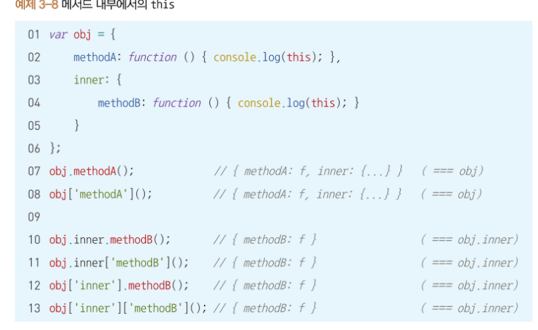

# Chapter3. this

**`this`**

- 다른 대부분의 객체지향 언어에서 `this` 는 클래스로 생성한 인스턴스 객체를 의미하지만, 자바스크립트에서의 `this` 는 어디서든 사용할 수 있음.
- `this` 는 자바스크립트에서 실질적으로 함수와 객체(메소드)의 구분하는 거의 유일한 기능임. **상황에 따라 `this`가 바라보는 대상이 달라**지므로 정확한 자동 방식을 이해하지 못하면 원인을 파악해서 해결 할 수 없다.
- t`his` 는 **함수를 어떤 방식으로 호출하느냐에 따라** 달라지는 방법과 **명시적으로 `this` 에 별도의 대상을 바인딩**하는 방법이 있다.

## 1️⃣ 상황에 따라 달라지는 `this`

- 자바스크립트에서 `this`는 실행 컨텍스트가 생성될 때 결정된다.
    
    즉, 함수를 호출하는 방식에 따라 `this`의 값이 달라진다.
    
- **1. 전역 공간에서의 `this`**
    
    전역 공간에서의 `this`는 전역 객체를 참조한다. 브라우저 환경에서는 `window`, Node.js 환경에서는 `global` 객체를 가르킨다.
    
    ```jsx
    // 브라우저 환경
    console.log(this); // 브라우저에서는 window 객체 출력
    console.log(window); // window 객체 출력
    console.log(this === window); // true
    
    // node.js 환경
    console.log(this); //{ process: {title: 'node', version: ...) }
    console.log(global); //{ process: {title: 'node', version: ...) }
    console.log(this === global); // true
    ```
    
    전**역 변수를 선언하면 자바스크립트 엔진은 이를 전역객체의 프로퍼티로 할당함!**
    
    ```jsx
    var a = 1;
    console.log(a); // 1
    console.log(window.a); // 1
    console.log(this.a); // 1
    ```
    
    그러나 `let`이나 `const`로 선언한 변수는 전역 객체의 프로퍼티로 할당되지 않는다.
    
    ```jsx
    let b = 2;
    console.log(b); // 2
    console.log(window.b); // undefined
    console.log(this.b); // undefined
    ```
    
- **2.** **메서드로서 호출할 때의 `this`**
    - 함수 vs 메서드
        - 차이점 : `‘독립성’`
        함수 → 그 자체로 독립적인 기능을 수행
        메서드 → 자신이 호출한 대상 객체에 관련된 동작을 수행
            
            ```jsx
            var func = function(x){
              console.log(this,x);
            }
            func(1);     // window { ... } 1
            
            var obj={
              method:func
            };
            obj.method(2);     // // { method: f } 2
            
            // 즉, 함수를 어떻게 호출하느냐에 따라 this값이 달라짐
            ```
            
            - 어떤 함수를 호출할 때 프로퍼티명 앞에 객체가 명시된 경우 → 메서드로 호출
            그렇지 않은 모든 경우 → 함수로 호출
                
                ```jsx
                var obj = {
                  method: function (x) { console.log(this, x); }
                };
                obj.method(1);       // { method: f } 1
                obj.['method'](2).   // { method: f } 2
                ```
                
            
    - **메서드 내부에서의 `this`**
        - `this` 에는 호출한 주체에 대한 정보가 담김
        어떤 함수를 메서드로서 호출하는 경우 호출 주체는 함수명(프로퍼티명) 앞의 객체임
        - 점 표기법의 경우 마지막 점 앞에 명시된 객체가 곧 `this` 가 됨
            
            
            
- **3. 함수로서 호출할 때의 `this`**
    - 함수 내부에서의 `this`
        - 함수가 호출이되는 순간 ( = 실행 컨텍스트가 생성되는 순간)에 `this`가 지정됨
        - 즉, 함수에서의 `this` → 전역 객체를 가리킴
    - 메서드 내부함수에서의 `this`
        
        ```jsx
        var obj1 = {
          outer: function () {
            console.log(this);  // (1)
            
            var innerFunc = function () {
              console.log(this);  // (2)
            };
            innerFunc();
            
            var obj2 = {
              innerMethod: innerFunc
            };
            obj2.innerMethod();  // (3)
          }
        };
        obj1.outer();
        ```
        
        1. **obj1.outer(); 실행**
            - outer 메서드는 obj1.outer();로 호출됨 → this === obj1
            - 즉, this는 **obj1을 가리킨다.** ✅
            - **출력값:** { outer: f } (즉, obj1 객체)
        2. **2단계: innerFunc(); 호출**
            - **일반 함수 호출이므로 this는 전역 객체를 가리킴**
            - innerFunc는 obj1과 연결되지 않은 **독립적인 함수**이기 때문
            - **출력값:**  브라우저(window),  Node.js(global)
        3.  **3단계: obj2.innerMethod(); 실행**
            - obj2.innerMethod 함수의 실행 컨텍스트가 생성됨. 이 함수는 innerMethod앞에 점(.)이 있었으므로 메서드로서 호출한 것임 → obj2가 바인딩 됨
            - **출력값:  obj2 객체정보 출력**
        - 즉, this 바인딩은 함수를 실행하는 당시의 주변환경은 중요하지x
         해당 함수를 호출하는 구문 앞에 점 또는 대괄호 표기가 있는지 없는지가 관건!
    - 메서드 내부 함수에서의 `this` 우회 방법
        1. 상위 스코프에 `this` 객체 값을 할당받은 변수를 선언하는 방법
        
        ```jsx
        var obj = {
          outer : function(){
            console.log(this); // obj 객체
            var innerFunc1 = function(){
              console.log(this); // window 객체 (단독 호출 시)
            }
            innerFunc1();
            var self = this; // this를 self에 저장
            var innerFunc2 = function(){
              console.log(self); // obj 객체 (self로 우회)
            }
            innerFunc2();
          }
        }
        obj.outer();
        
        // 상위 스코프의 this 객체를 self 변수에 할당하여 내부 함수에서 이를 활용함.
        ```
        
        1. **화살표 함수(Arrow Function) 사용 (ES6)**
            
            ```jsx
            var obj = {
              outer : function(){
                console.log(this); // obj 객체
                var innerFunc1 = function(){
                  console.log(this); // window 객체 (단독 호출 시)
                }
                innerFunc1();
            
                var innerFunc2 = ()=>{
                  console.log(this); // obj 객체 (화살표 함수는 상위 스코프의 `this`를 그대로 사용)
                }
                
                innerFunc2();
              }
            }
            obj.outer();
            
            //	•	화살표 함수는 this를 바인딩하지 않으므로, **상위 스코프의 this**를 그대로 사용.
            ```
            
        2. 
    
- **4.  콜백 함수 호출 시의 `this`**
    - 1. 콜백 함수 호출 시 내부에서의 `this`
        
        콜백 함수는 기본적으로 전역 객체(`window` 또는 `global`)를 참조함. 그러나 제어권을 받은 함수에서 콜백 함수에 대해 `this`를 명시적으로 지정하면 해당 객체를 참조한다.
        
    - 예시: `addEventListener`에서의 `this`
        
        ```jsx
        document.body.innerHTML += `<button id="a">클릭</button>`;
        document.body.querySelector("#a")
          .addEventListener('click', function (e) {
            console.log(this); // <button id="a">클릭</button>
          });
          
          // addEventListener 메서드가 콜백 함수에 대해 this를 명시적으로 바인딩함 -> 따라서 이벤트가 발생한 button 요소가 this로 참조도미.
        ```
        
    - **2. 생성자 함수 내부에서의 `this`**
        
        생성자 함수를 호출하면 해당 함수가 생성하는 객체(`this`)에 속성을 할당한다.
        
    - 예시: 생성자 함수에서의 `this`
        
        ```jsx
        var Cat = function (name, age) {
          this.name = name;
          this.age = age;
        }
        
        var choco = new Cat("choco", 5);
        var nabi = new Cat("gamja", 3);
        
        console.log(choco); // Cat {name: 'choco', age: 5}
        console.log(nabi);  // Cat {name: 'gamja', age: 3}
        
        // Cat 생성자 함수는 name과 age 속성을 갖는 객체를 생성한다.
        // new 연산자가 this를 해당 인스턴스를 참조하도록 함.
        
        ```
        

## 2️⃣ 명시적으로 `this`를 바인딩하는 방법

- 1. `call` 메서드
    - `call` 메서드는 함수를 호출할 때 `this`를 명시적으로 바인딩할 수 있습니다.
    - 예시: `call` 메서드
        
        ```jsx
        var func = function (a, b, c) {
          console.log(this, a, b, c);
        };
        
        func(1, 2, 3); // Window 1 2 3
        func.call({x: 1}, 2, 3, 4); // {x: 1} 2 3 4
        
        //call 메서드를 사용하면 첫 번째 인자로 전달한 객체가 this로 바인딩되며, 그 후 인수들을 전달할 수 있음.
        ```
        
- 2. `apply` 메서드
    - `apply` 메서드는 `call`과 동일한 방식으로 `this`를 바인딩하지만, 인수를 배열 형태로 전달해야 한다.
    - 예시: `apply` 메서드
        
        ```jsx
        var func = function (x, y, z) {
          console.log(this, x, y, z);
        };
        
        func.apply({x: 1}, [2, 3, 4]); // {x: 1} 2 3 4
        ```
        
- 3. `bind` 메서드
    - `bind` 메서드는 `this`와 인수를 지정하여 새로운 함수를 반환함. 반환된 함수는 나중에 호출될 때 지정된 `this` 값을 사용함.
    - 예시: `bind` 메서드
        
        ```jsx
        var func = function (a, b, c, d) {
          console.log(this, a, b, c, d);
        };
        func(1, 2, 3, 4). // window { ... } 1 2 3 4
        
        var bindFunc1 = func.bind({ x: 1});
        bindFunc1(5, 6, 7, 8); // {x: 1} 5 6 7 8
        
        var bindFunc2 = func.bind({ x: 1}, 4, 5);
        bindFunc2(6, 7);   // {x: 1} 4 5 6 7
        bindFunc2(8, 9);    // {x: 1} 4 5 8 9
        ```
        
- 4.  **call,apply,bind를 이용한 this를 내부함수나 콜백 함수에 전달하기**
    - 메서드 내부 함수에서의 this 우회 방법을 사용하지않고도 `call`,`bind`,`apply`메서드를 통해 깔끔하게 처리가능.
        
        ```jsx
        var obj ={
          outer : function(){
            console.log(this);
            var innerFunc = function(){
              console.log(this);
            }
            innerFunc.call(this);
          }
        }
        obj.outer();
        
        var obj ={
         outer : function(){
           console.log(this);
           var innerFunc = function(){
             console.log(this);
           }.bind(this);
           innerFunc();
         }
        }
        obj.outer();
        ```
        
- 5. 화살표 함수 (Arrow Function)
    - 화살표 함수는 `this`를 바인딩하는 과정이 없으며, 자신이 선언된 스코프에서 `this`를 상속받는다.
    - 예시: 화살표 함수에서의 `this`
    
    ```jsx
    var obj = {
      outer: function() {
        console.log(this); // obj
    
        var innerFunc = () => {
          console.log(this); // obj
        };
        innerFunc();
      }
    };
    
    obj.outer();
    
    ```
    
    - 화살표 함수를 사용하면 `this`가 해당 함수의 상위 스코프에서 정의된 `this`를 그대로 참조하게 되어, `call`, `apply`, `bind` 메서드를 사용할 필요가 없습니다.

## 4️⃣ `this` 바인딩 정리

- 암묵적 `this` 바인딩
    - 전역에서의 `this`는 전역 객체를 참조함.
    - 메서드로 호출된 함수에서의 `this`는 호출된 객체를 참조함.
    - 함수로 호출된 함수에서의 `this`는 전역 객체를 참조함.
    - 콜백 함수에서의 `this`는 해당 콜백 함수를 호출한 함수가 정의한 대로 결정됨.
     정의하지 않으면 전역 객체를 참조함.
    - 생성자 함수에서의 `this`는 생성된 인스턴스를 참조함.다.
- 명시적 `this` 바인딩
    - `call`, `apply` 메서드는 `this`를 명시적으로 지정하여 함수나 메서드를 호출함.
    - `bind` 메서드는 `this`와 인수들을 지정하여 새로운 함수를 반환함.
    - 이벤트 핸들러나 콜백 함수에서 `this`는 `addEventListener` 등의 메서드에서 자동으로 바인딩됨.