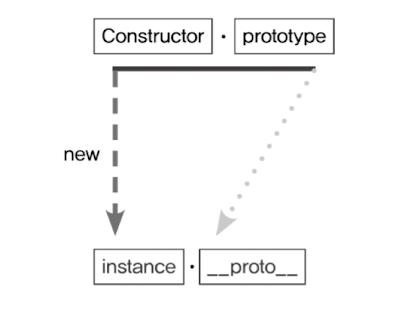
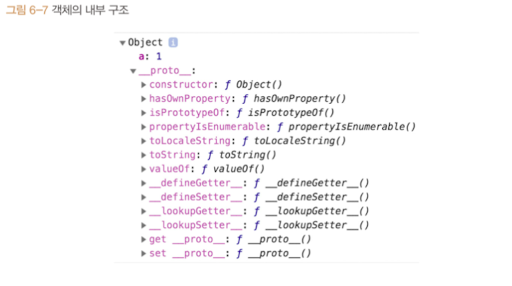
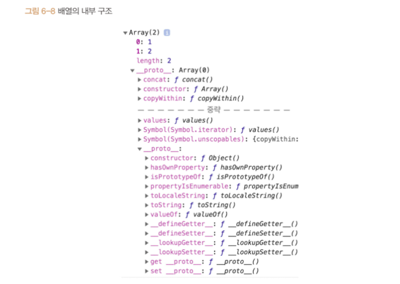
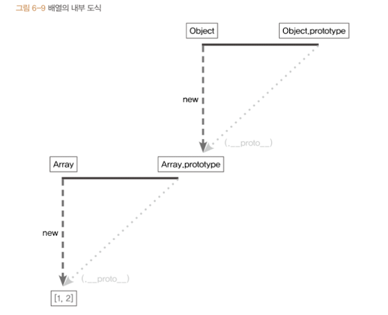

# 프로토타입

- **1️⃣ 프로토타입의 개념 이해**
    <aside>
    
    ❗️  자바스크립트는 **`프로토타입`** 기반 언어이다.   클래스 기반 언어는 **`상속`**을 사용하지만, 
    
    프로토타입 기반 언어에서는, **`어떤 객체를 원형(prototype)으로 삼고 이를 복제(참조)`**함으로 써
    상속과 비슷한 효과를 냄.
    
    </aside>
    
    - **1-1. constructor, prototype, instance**
        
        ```jsx
        var instance = new Constructor();
        ```
        
        
        
        위의 코드를 추상화 한 그림
        
        1. 어떤 생성자 함수(Constructor)를 **`new`** 연산자와 함께 호출하면, Constructor에서 정의된 내용을 바탕으로 새로운 **`인스턴스(instance)`**가 생성된다.
        2. 이때 instance에는 ‘Constructor.prototype’을 그대로 참조하는 `__proto__`라는 프로퍼티가 자동을 부여되는데*(상속과 비슷한 효과)*
        3. 이 프로퍼티는 ‘Constructor.prototype’을 그대로 참조하기에 ‘instance.__proto__.method’를 통해 ‘Constructor.prototype’ 내에 있는 메소드에 접근할 수 있다.
        4. 하지만 `__proto__` 를 생략할 수 도 있기때문에 ‘instance.method’로 접근해 마치 instance 자체에 있는 메소드 처럼 사용 가능함.
        
    - `prototype` **과** 이를 참조하는 `__proto__`는 모두 **객체임**
     prototype 객체 내부에는 인스턴스가 사용할 메서드를 저장한다.
    → `인스턴스`에서도 숨겨진 프로퍼티인 `__proto__` 를 통해 이 메서드들에 접근할 수 있게 된다.
    
    - Person이라는 생성자 함수의 prototype에 getName이라는 메서드를 지정했다고 생각해보자!
    
    ```jsx
    var Person = function(name) {
      this.name = name;
    };
    Person.prototype.getName = function() {
      return this._name;
    };
    
    var suzi = new Person('Suzi');
    suzi.__proto__.getName(); // undefined
    
    Person.prototype === suzi.__proto__ // true
    ```
    
    1. Person이라는 생성자 함수를 만들고 (함수를 만들면 JS는 자동으로 prototype이라는 객체를 부여한다.)
    2. Person.prototype에 getName이라는 프로퍼티를 부여한다.
    3. Person을 통해 suzi라는 instance를 만들고 suzi.__proto__를 통해 getName 메소드를 호출하면
    4. getName 메소드에서의 this는 suzi.__proto__에 바인딩된다. 하지만 ‘suzi.__proto__’에는 name 프로퍼티가 없으므로 undefined가 출력된다.
    5. 이를 해결하기 위해서는 suzi.__proto__에 name을 정의해주거나
        
        ```jsx
        var suzi = new Person('Suzi');
        suzi.__proto__._name = 'suzi__proto__'
        suzi.__proto__.gerName(); // suzi__proto__
        ```
        
    6. ‘**proto**’를 생략해주어 this가 바로 인스턴스로 바인딩 되도록 하면 된다.
    
    ```jsx
    var suzi = new Person('Suzi', 28);
    suzi.getName(); // Suzi
    var iu = new Person('Jieun', 28);
    iu.getName(); //  Jieun
    ```
    
    - **1-2. constructor 프로퍼티**
        
        <aside>
        
        생상자 함수의 프로퍼티인 Prototype 내부에는 constructor 라는 프로퍼티가 있음.
        인스턴스의 `__proto__` 객체에도 마찬가지임.
        이 프로퍼티는 원래의 생성자 함수(자기 자신)를 참조함.
        (인스턴스로부터 그 원형이 무엇인지 알 수 있는 수단이기 때문)
        
        </aside>
        
        ```jsx
        // constructor 프로퍼티
        let arr = [1, 2];
        Array.prototype.constructor == Array // true
        arr.__proto__.constructor == Array // true
        arr.constructor == Array // true
        
        let arr2 = new arr.constructor(3, 4);
        console.log(arr2); // [3, 4]
        ```
        
        - constructor는 읽기 전용 속성(기본형 리터럴 변수 - number, string, boolean)이 부여된 예외적인 경우를 제외하고는 값을 바꿀 수 있음.
        - constructor를 변경하더라도 참조하는 대상이 변경될 뿐 **이미 만들어진 인스턴스의 원형이 바뀐다거나 데이터 타입이 변하는 것은 아님**.
        - 어떤 인스턴스의 생성자 정보를 알아내기 위해 constructor 프로퍼티에 의존하는것이 항상 안전하지는 않음.

---

- **2️⃣ 프로토타입 체인**

  - **2-1. 메서드 오버라이드**

    - 인스턴스가 동일한 이름의 프로퍼티나 메소드를 가지게 되면 **`메소드 오버라이드`** 가 일어난다.

      ```jsx
      let Person = function (name) {
        this.name = name;
      };
      Person.prototype.getName = function () {
        return this.name;
      };

      let iu = new Person("지금");
      iu.getName = function () {
        return "바로 " + this.name;
      };
      console.log(iu.getName()); // 바로 지금
      ```

    - 원본이 제거되고 다른 대상으로 교체되는 것이 아니라, 원본이 그대로 있는 상태에서 다른 대상을 그 위에 얹는다고 생각 하는 것이 좋음.
    - 자바스크립트 엔진이 getName 메소드를 찾는 방식은
      - 가장 가까운 대상인 자신의 프로퍼티를 검색하고
      - 없으면 다음으로 가까운 대상인 `__proto__`를 검색하는 순서로 진행됨.
      - 즉 순서가 밀리기 때문에 `__proto__` 의 메소드가 노출되지 않는 것임
    - 만일, 인스턴스를 바라보도록 바꿔주고 싶다면 `call` 이나 `apply` 를 사용 하면 된다.

    ```jsx
    console.log(iu.__proto__.getName.call(iu)); // 지금
    ```

  - **2-2. 프로토타입 체인**

    ```jsx
    // 배열의 내부 구조
    console.dir({ a: 1 });
    ```

    

    ```jsx
    // 배열의 내부 구조
    console.dir([1, 2]);
    ```

    

    - 배열의 내부 구조를 보면 `__proto__` 안에 다시 `__proto__`가 있는 것을 확인할 수 있음
    - 이는 prototype 객체가 **객체**이기 때문임.
    - 모든 객체의 `__proto__` 에는 Object.prototype이 연결된다.
      
    - `__proto__`는 생략이 가능하기 때문에, 배열이 `Array.prototype` 내부의 메서드를 자신의 것처럼 사용할 수 있음( = 객체 메서드로 실행이 가능!)

    ```jsx
    let arr = [1, 2];
    arr(.__proto__).push(3);
    arr(.__proto__)(.__proto__).hasOwnProperty(2); // true
    ```

    - 프로토 타입 체인 :  어떤 데이터의 `__proto__` 프로퍼티 내부에 다시 `__proto__` 프로퍼티가 연쇄적으로 이어진 것
    - **프로토타입 체이닝** : 프로토타입 체인을 따라가며 검색하는 것

    - 메서드 오버라이드와 프로토 타입 체이닝 예시 예제

    ```jsx
    let arr = [1, 2];
    Array.prototype.toString.call(arr); // 1, 2
    Object.prototype.toString.call(arr); // [object Array]
    arr.toString(); // 1, 2

    arr.toString = function () {
      return this.join("_");
    };
    arr.toString(); // 1_2
    ```

  - **2-3. 객체 전용 메서드의 예외사항**
    - 생성자 함수의 prototype은 반드시 객체이므로 Object.prototype이 언제나 프로토타입 체인의 최상단에 존재한다.
    - 따라서 객체에서만 사용할 메소드는 다른 모든 데이터 타입처럼 프로토타입 객체 안에 정의할 수 없음
    - 객체에서만 사용할 메서드를 Object.prototype 내부에 정의한다면, 다른 데이터 타입도 해당 메서드를 사용할 수 있게 되기 때문
    ```jsx
    Object.prototype.getEntries = function () {
      let res = [];
      for (let prop in this) {
        if (this.hasOwnProperty(prop)) {
          res.push([prop, this[prop]]);
        }
      }
      return res;
    };
    let data = [
      ["object", { a: 1, b: 2, c: 3 }], //[["a",1], ["b",2],["c",3]]
      ["number", 345], // []
      ["string", "abc"], //[["0","a"], ["1","b"], ["2","c"]]
      ["boolean", false], //[]
      ["func", function () {}], //[]
      ["array", [1, 2, 3]],
      // [["0", 1], ["1", 2], ["2", 3]]
    ];
    data.forEach(function (datum) {
      console.log(datum[1].getEntries());
    });
    ```
    - 따라서 객체 전용 메서드는 Object.prototype이 아닌 static method로 부여해야 한다.
  - **2-4. 다중 프로토타입 체인**

    - 자바스크립트의 기본 내장 타입들은 일반적으로 1~2단계의 짧은 프로토타입 체인을 가짐.
    - 사용자가 직접 객체를 만들 경우, `__proto__`를 수직으로 이어 붙여 무한히 긴 체인도 가능.
    - 이 방식을 이용하면 다른 언어의 클래스처럼 계층 구조를 흉내낼 수 있음.

    - 아래는 배열처럼 동작하는 사용자 정의 객체 예제임

    ```jsx
    let Grade = function () {
      let args = Array.prototype.slice.call(arguments);
      for (let i = 0; i < args.length; i++) {
        this[i] = args[i];
      }
      this.length = args.length;
    };

    let g = new Grade(100, 80);
    ```

    - `g`는 `Grade`의 인스턴스이며
    - 배열의 형태를 지니지만, 배열 메서드(`pop`, `push` 등)는 사용할 수 없는 유사 배열 객체이다.

    ```jsx
    Grade.prototype = [];
    ```

    - `Grade.prototype`을 배열 인스턴스로 설정하면,
    - `g`는 배열처럼 동작할 수 있음. (프로토타입 체인: `g → Grade.prototype([]) → Array.prototype → Object.prototype`)

    ```jsx
    console.log(g); // Grade(2) [100, 80]
    g.pop();
    console.log(g); // Grade(1) [100]
    g.push(90);
    console.log(g); // Grade(2) [100, 90]
    ```

---

- **3️⃣ 정리**
  **1. 인스턴스 생성과 `__proto__`**
  - `new 생성자함수()`를 호출하면, 내부에서 `__proto__`가 생성되어 `생성자함수.prototype`을 참조함.
  - 인스턴스는 `prototype`의 메서드를 자신의 것처럼 호출 가능 (`__proto__`는 생략됨).
  ***
  **2. `constructor` 프로퍼티**
  - `생성자함수.prototype.constructor`는 생성자 함수 자신을 가리킴.
  - 인스턴스가 자신의 생성자를 알고 싶을 때 사용함.
  ***
  **3. 프로토타입 체이닝**
  - `__proto__`를 따라 위로 올라가며 메서드를 검색하는 과정.
  - 가장 가까운 곳에서 찾고, 없으면 다음 단계로 이동 → 최종적으로 `Object.prototype`에 도달.
  ***
  **4. Object.prototype의 역할**
  - `Object.prototype`: 모든 객체가 공유하는 범용 메서드 보유.
  - 객체 전용 메서드(`Object.keys`, `Object.assign` 등)는 `Object` 생성자 함수에 static으로 존재.
  ***
  **5. 프로토타입 체인의 유연성**
  - 체인은 꼭 2단계일 필요 없음.
  - 사용자 정의 객체를 통해 다단계 체인도 얼마든지 구성 가능.
